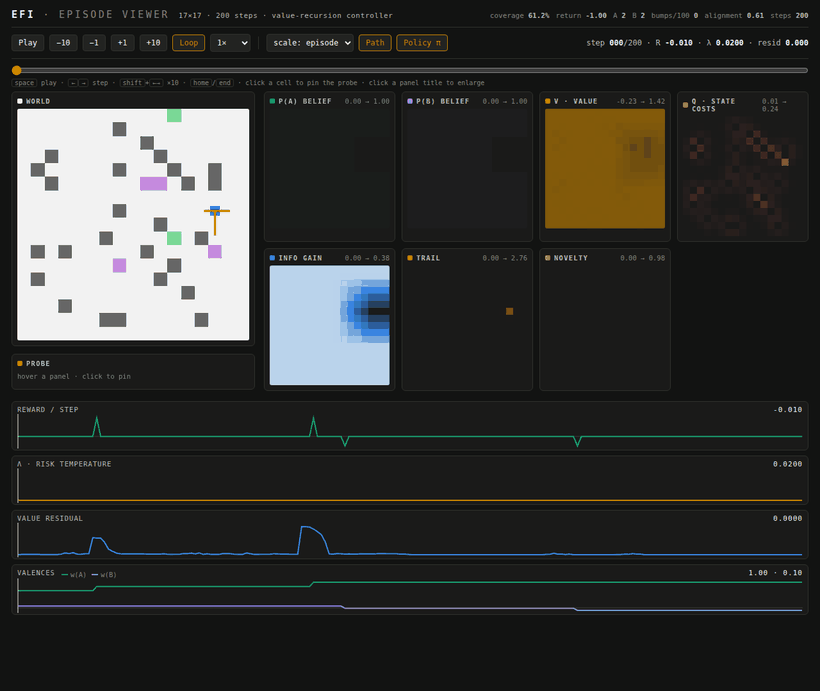
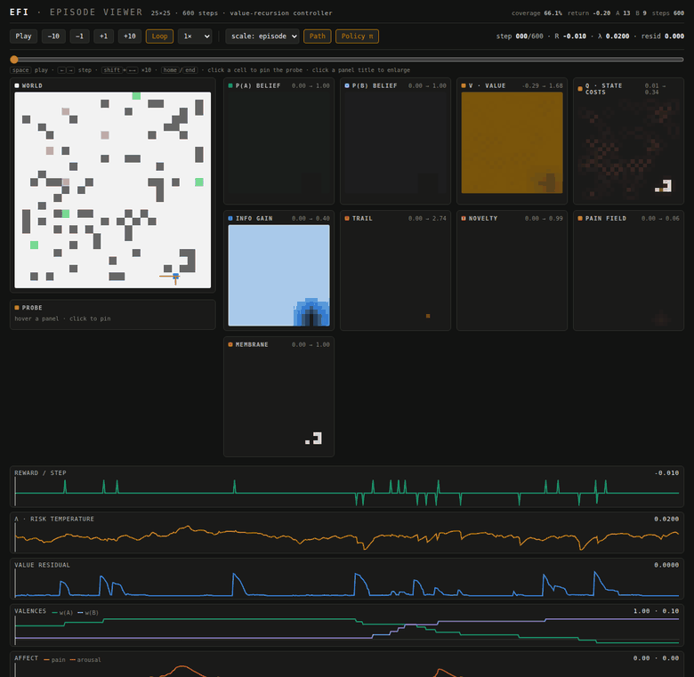

# Embodied Field Intelligence (EFI)

[](https://github.com/jbwinters/embodied-field-intelligence/actions/workflows/ci.yml)
[](LICENSE)
[](pyproject.toml)

A framework for embodied artificial intelligence from local field dynamics: an agent with a 5×5 window and internal state only, controlled by Bayes-filter belief fields and a linearly-solvable-MDP value recursion — zero training episodes.



*The episode viewer (`python cli.py interactive`, then open `runs/interactive_latest.html`): the agent's beliefs p(A)/p(B), value field V, state costs q, and information-gain reward evolve as it forages; orange arrows are the live policy distribution π ∝ exp(V/λ). Telemetry strips track reward, λ, the value-sweep residual, and learned valences — hover any panel for a synchronized cell probe. Regenerate this animation with `python scripts/make_viewer_demo.py`.*

### Watch it re-value the world

At step 300 the rewards swap: everything the agent liked becomes aversive and vice versa. Because values are recomputed from beliefs every tick (not memorized), a few pickups flip the learned valences and the whole policy reverses — watch the VALENCES strip cross and the reward spikes resume on the other side of the swap line:



*25×25, regrowing targets, reward swap at step 300 (`python scripts/make_swap_demo.py`). This is the revaluation experiment from the paper (adaptation lag 5 steps vs 69–83 for trained baselines), playing live.*

## Overview

EFI explores the use of cellular automata (CA) as a substrate for real-time, distributed intelligence in embodied agents. Behavior emerges from local field dynamics — attractor and repulsor fields updated by masked diffusion and composed into a single potential whose gradient selects actions — rather than from a centralized planner or policy network. The framework combines:

- **Chemotaxis Fields**: Diffusion-based scent trails for navigation
- **Memory Systems**: Visit trails and novelty detection
- **Schema Learning**: Local Oja/BCM/slowness-based prototype learning
- **Affect & Membranes**: Nociception-driven safety fields and learning gates
- **CA-Native Processing**: Computations built from local field operations

**Results at a glance** (17×17 ForageWorld, identical seeds, 200 episodes/agent; normalized = (X − random)/(oracle − random); reproduce with `python scripts/make_baseline_table.py`):

| Agent | Mean return | Success | Normalized score | Training episodes |
|---|---|---|---|---|
| Random walk | −2.795 ± 0.909 | 6.0% | 0.00 | 0 |
| Greedy-visible | −1.386 ± 0.797 | 22.5% | 0.50 | 0 |
| Tabular Q | −2.841 ± 1.546 | 0.5% | −0.02 | 2000 |
| **EFI (this repo)** | **−0.087 ± 0.286** | **96.5%** | **0.97** | **0** |
| A* oracle (ceiling) | −0.000 ± 0.000 | 100.0% | 1.00 | 0 |

EFI reaches 97% of a full-observability oracle **with zero training episodes**, from a 5×5 window and internal field dynamics alone. The control law is a linearly-solvable-MDP value recursion computed as a local field operation (see [docs/THEORY.md](docs/THEORY.md)); success no longer degrades with grid size (98.9% at both 15×15 and 30×30). Older results: [experiment report](docs/EXPERIMENT_REPORT.md), [research site](https://jbwinters.github.io/embodied-field-intelligence/), [roadmap](docs/ROADMAP.md), [paper draft](paper/efi_paper.tex).

## Installation

Requires Python 3.10+.

### Basic Installation

```bash
pip install -e .
```

### Development Installation

```bash
pip install -e ".[dev]"
```

### Optional Dependencies

For Gymnasium integration:
```bash
pip install -e ".[gym]"
```

For video generation:
```bash
pip install -e ".[viz]"
```

## Quick Start

### Run a Demo

```bash
# Basic demo with 5 episodes
python cli.py demo --episodes 5

# Demo with live visualization
python cli.py demo --episodes 5 --render live

# Save video of last episode
python cli.py demo --episodes 5 --save-video demo.mp4
```

### Interactive Viewer

Run an episode with an interactive viewer that allows you to:
- Play/pause animation
- Step forward/backward through frames
- Adjust playback speed
- Scrub through frames with a slider
- View all CA fields in real-time

```bash
# Launch interactive viewer
python cli.py interactive

# Launch with auto-play
python cli.py interactive --auto-play

# Configure environment
python cli.py interactive --H 20 --W 20 --max-steps 150
```

**Note**: The interactive viewer automatically detects your environment:
- **With display**: Opens matplotlib interactive window
- **Headless/SSH**: Generates an HTML file you can open in any browser

The HTML viewer provides the same controls as the matplotlib version and works on any system. After running, it will output a path like:
```
HTML viewer saved to: runs/interactive_20250816-170917.html
```

Open this file in your browser to interact with the episode.

### Run Evaluation

```bash
# Evaluate over 50 episodes with 3 seeds
python cli.py eval --episodes 50 --seeds 3 --out results/eval1

# Evaluate with specific ablations
python cli.py eval --episodes 50 --novelty 0 --schema 1 --out results/no_novelty
```

### Run Ablation Suite

```bash
# Run full ablation suite
python cli.py suite --episodes 20 --seeds 5 --out results/ablations
```

### Register Gymnasium Environment

```bash
# Register environment for use with RL libraries
python cli.py gym-register
```

Then use in your code:
```python
import gymnasium as gym
env = gym.make("CAForage-v0")
```

## Project Structure

```
embodied_field_intelligence/
├── efi/                    # Main package
│   ├── configs/           # Configuration dataclasses
│   ├── core/              # Core utilities (diffusion, fields, affect, membranes)
│   ├── agents/            # Agent implementations
│   ├── envs/              # Environment and Gym wrapper
│   ├── evaluation/        # Experiment runners and metrics
│   ├── visualization/     # Plotting and video generation
│   └── cli.py             # Command-line interface (`efi` console script)
├── tests/                 # Unit tests
├── scripts/               # Analysis and demo utilities
├── docs/                  # Documentation, reports, and research site
├── paper/                 # LaTeX paper draft
└── cli.py                 # Thin shim so `python cli.py ...` works from the repo root
```

## Key Components

### Chemotaxis Agent

The `ChemotaxisAgentCA` maintains multiple CA fields:
- **GA/GB**: Attractive scent fields for targets
- **Vtrail**: Repulsive visit trail for exploration
- **Novel**: Novelty field based on prediction error
- **Corner Hazard**: Static hazard map for navigation safety

### Schema Field

The `SchemaField` learns local prototypes using:
- **Oja normalization**: Stable Hebbian learning
- **BCM threshold**: Competitive dynamics
- **Slowness penalty**: Temporal stability
- **Diffusion**: Smooth activation maps

### Ablations

Test contributions of different components:
- `--trail 0`: Disable visit trail
- `--novelty 0`: Disable novelty detection
- `--corner 0`: Disable corner hazard
- `--schema 0`: Disable schema learning

## Configuration

### Environment Parameters

- `--H`, `--W`: Grid dimensions (default: 17x17)
- `--win`: Observation window size (default: 5)
- `--p-wall`: Wall generation probability (default: 0.12)
- `--nA`, `--nB`: Number of targets (default: 3 each)
- `--max-steps`: Episode length (default: 200)

### Agent Parameters

- `--seed-strength`: Scent injection strength (default: 0.6)
- `--scent-diff`: Scent diffusion rate (default: 0.14)
- `--v-decay`: Visit trail decay rate (default: 0.03)
- `--anti-stuck-temp`: Temperature for stuck recovery (default: 0.6)

### Schema Parameters

- `--schema-tile`: Tile size for prototypes (default: 5)
- `--schema-K`: Prototypes per tile (default: 4)
- `--schema-eta`: Learning rate (default: 0.03)
- `--schema-slowness`: Slowness penalty (default: 0.02)

## Testing

Run tests with pytest:

```bash
# Run all tests
pytest

# Run with coverage
pytest --cov=efi

# Run specific test file
pytest tests/test_diffusion.py
```

## Experiments

### Running Custom Experiments

```python
from efi.configs import EnvConfig, AgentConfig, SchemaConfig, Ablations
from efi.evaluation import run_experiment

# Configure experiment
env_cfg = EnvConfig(H=20, W=20, n_targets_A=5)
agent_cfg = AgentConfig(seed_strength=0.8)
schema_cfg = SchemaConfig(K=6, eta=0.05)
ablate = Ablations(trail=1, novelty=1, corner=1, schema=1)

# Run experiment
results = run_experiment(
    env_cfg, agent_cfg, schema_cfg, ablate,
    episodes=100, seeds=10
)

print(f"Mean return: {results.mean_return:.3f} ± {results.std_return:.3f}")
```

### Visualization

```python
from efi.visualization import plot_experiment_results

# Plot results
fig = plot_experiment_results(results, save_path="results.png")
```

## Citation

If you use this code in your research, please cite:

```bibtex
@software{efi2025,
  title={Embodied Field Intelligence},
  author={Joshua Winters},
  year={2025},
  url={https://github.com/jbwinters/embodied-field-intelligence}
}
```

## License

MIT License - see LICENSE file for details.

## Contributing

Contributions are welcome! Please:
1. Fork the repository
2. Create a feature branch
3. Add tests for new functionality
4. Submit a pull request

## Acknowledgments

This project builds on research in:
- Cellular automata and self-organization
- Reservoir computing
- Chemotaxis and stigmergy
- Neural cellular automata (NCA)
- Artificial General Intelligence (AGI)
