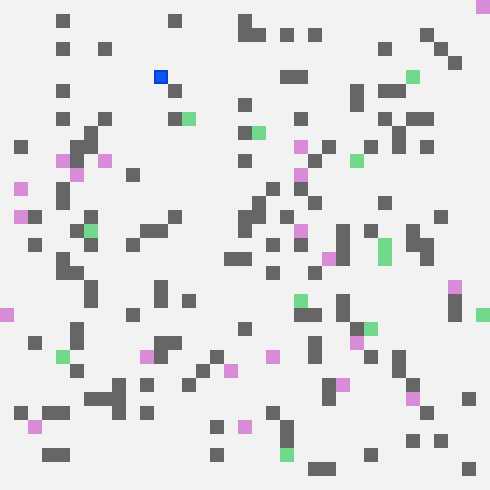
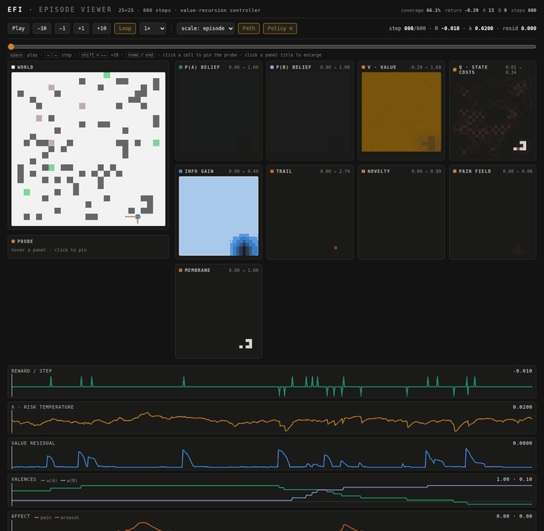
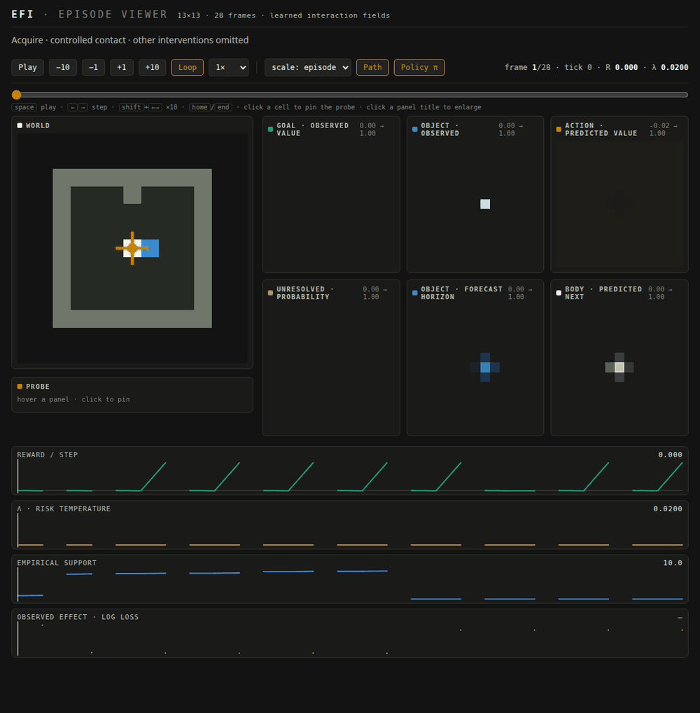

# Embodied Field Intelligence (EFI)

[](https://github.com/jbwinters/embodied-field-intelligence/actions/workflows/ci.yml)
[](LICENSE)
[](pyproject.toml)

EFI is a research framework for embodied agents whose "mind" is a grid of
interacting fields rather than a trained neural network. The agent senses
only a small local window. What it senses seeds belief, memory, and value
fields, and bounded local updates spread that information across the grid,
much as weather moves across a map. Actions follow from the resulting field
gradients, with no central controller and, for the foraging agent, no
training episodes.

Everything runs on a CPU with NumPy, and every internal quantity can be
inspected. The recorded episode players show the fields, predictions, and
action probabilities behind each move.



*35×35 grid, 12 appetitive targets (green), 20 aversive ones (magenta), zero
training episodes. The agent maps hazards from single glances and plans
around them as path costs. It collects **all 12 appetitive targets while
touching exactly one aversive target**, the one it needed to taste to learn
its sign. Blue trace = recent path. Reproduce: `python scripts/make_grid_demo.py`.*

**Contents:** [Results](#results) · [Installation](#installation) ·
[Quick start](#quick-start) · [How it works](#how-it-works) ·
[Documentation](#documentation) · [Citation](#citation)

## Results

### Foraging from a 5×5 window, with zero training

On a 17×17 ForageWorld with identical seeds and 200 episodes per agent
(normalized score = (X − random) / (oracle − random)):

| Agent | Mean return | Success | Normalized score | Training episodes |
|---|---|---|---|---|
| Random walk | −2.795 ± 0.909 | 6.0% | 0.00 | 0 |
| Greedy-visible | −1.386 ± 0.797 | 22.5% | 0.50 | 0 |
| Tabular Q | −2.841 ± 1.546 | 0.5% | −0.02 | 2000 |
| **EFI** | **−0.087 ± 0.286** | **96.5%** | **0.97** | **0** |
| A* oracle (ceiling) | −0.000 ± 0.000 | 100.0% | 1.00 | 0 |

EFI reaches 97% of a full-observability oracle from a 5×5 window and its
internal field dynamics alone. Its control law is a linearly-solvable-MDP
value recursion computed as a local field operation ([theory](docs/THEORY.md)).
Success is 98.9% at both of the other tested sizes, 15×15 and 30×30; this does
not establish size-independent performance in general. Reproduce with
`python scripts/make_baseline_table.py`.

### Re-valuing the world mid-episode

In the revaluation experiment, rewards swap at step 300: everything the
agent liked becomes aversive, and vice versa. Values are recomputed from
beliefs every tick rather than memorized, so a few pickups flip the learned
valences and the whole policy reverses. The adaptation lag is **5 steps**,
versus 69–83 for trained and greedy baselines
([non-stationary worlds](docs/EXPERIMENTS_NONSTAT.md)).



*25×25, regrowing targets, reward swap at step 300. Watch the VALENCES strip
cross and the reward spikes resume after the swap line. Reproduce:
`python scripts/make_swap_demo.py`.*

### Learning from online experience

Later experiments add opt-in controllers that learn from their own actual
feedback. Each was evaluated on held-out seeds against controls, and each
report states what was supplied, what was learned, and where it fails.

| Experiment | Result | Report |
|---|---|---|
| **Anticipating moving hazards.** Learn local hazard motion and use four-step forecasts to move or wait. | 95.25% crossing success during learning, 99.25% in larger corridors, 89.75% after the motion rule reverses | [Predictive crossing](docs/PREDICTIVE_CONTROL.md) |
| **Reusing motion across tasks.** Apply motion learned while avoiding hazards to intercepting moving rewards in rooms. | 81.25% success with transferred knowledge vs 49.58% with an empty model (20 seeds, obstacles plus moving hazard) | [Motion transfer](docs/PREDICTIVE_TRANSFER.md) |
| **Learning what contact does.** Predict how pushing an object moves it, then approach from a useful side. | 93.65% / 92.40% goal collection in two rearranged scenes vs 66.46% / 65.83% with no prior experience (40 held-out seeds) | [Contact learning](docs/INTERACTION_LEARNING.md) |
| **Learning what a command changes.** Two commands leave the body still but move an object differently. | 87.81% success vs 17.89% with the commands pooled and 48.28% with no prior experience (40 held-out seeds) | [Command consequences](docs/COMMAND_CONSEQUENCES.md) |
| **Recognizing a returning context.** A bounded memory of response models is reused when an earlier response law returns. | 64.0% fewer prediction errors when a condition returns; **behavioral performance did not meet its acceptance bar** | [Returning-context memory](docs/CONTEXT_MEMORY.md) |



*The contact learner in the episode viewer: recorded fields and the
probabilities of all five actions. Open the
[180-move continuous replay](docs/assets/interactive/interaction_long.html),
in which one agent starts with empty memory and keeps learning through
obstacles and two changes in how the object responds.*

These controllers are separate experimental programs, not one agent that
has every capability at once. The returning-context result is mixed: its
prediction gain is real, but it did not maintain behavior. The default
foraging controller is unchanged by all of them.

## Installation

Requires Python 3.10+. From the repository root, preferably in a virtual
environment:

```bash
pip install -e .            # core
pip install -e ".[dev]"     # plus pytest, coverage, and linters
pip install -e ".[gym]"     # plus the Gymnasium environment
pip install -e ".[viz]"     # plus video export
```

No GPU is required.

## Quick start

### Watch a recording, no install needed

The HTML players in [`docs/assets/interactive/`](docs/assets/interactive/)
work offline in any browser. On GitHub, open a file, choose **Download raw
file**, and open the download; GitHub itself shows only the HTML source. The
[documentation index](docs/README.md#watch-a-demo) describes each recording.

### Run the foraging agent

```bash
python cli.py interactive
```

This writes `runs/interactive_latest.html`, an offline episode player showing
the belief fields p(A)/p(B), the value field V, state costs q, the
information-gain reward, and the policy π ∝ exp(V/λ) as arrows. Telemetry
strips below it show reward, λ, value residual, valences, and affect, and
hovering over a cell probes its values. Options:

```bash
python cli.py interactive --H 20 --W 20 --max-steps 150   # grid size and length
python cli.py interactive --window --auto-play            # matplotlib window instead
python cli.py ascii --H 20 --W 20 --show-every 10         # terminal output
```

### Run a learning experiment

```bash
python cli.py contact-demo --seed 6 --max-steps 180 --out runs/contact-demo
```

Open `runs/contact-demo/episode.html`. One agent learns through 180 moves
with obstacles and two changes in how the object responds; the chapter
buttons jump to moves 60 and 120. This illustrates the two-step contact
learner; it is not a benchmark. Every report gives the exact commands to
reproduce its full evaluation, and `python cli.py --help` lists all commands.

### Evaluate and ablate

```bash
python cli.py demo --episodes 5                            # quick episodes
python cli.py eval --episodes 50 --seeds 3 --out results/eval1
python cli.py eval --episodes 50 --novelty 0 --out results/no_novelty
python cli.py suite --episodes 20 --seeds 5 --out results/ablations
```

Ablation flags include `--trail 0`, `--novelty 0`, `--corner 0`, and
`--schema 0`. Environment flags include `--H`/`--W` (grid size, default
17×17), `--win` (observation window, default 5), `--nA`/`--nB` (target
counts), and `--max-steps`. The foraging controller defaults to
`--controller field --control-mode lmdp`; `--controller chemotaxis` selects
the original scent-following controller.

The environment is also available through Gymnasium:

```python
import gymnasium as gym
from efi.envs.gym_wrapper import register_gym_env

register_gym_env()
env = gym.make("CAForage-v0")
```

## How it works

A 2D grid serves as the agent's internal workspace. The environment reveals
only a 5×5 window around the agent; everything else the agent "knows" lives
in fields it maintains itself:

- **Belief fields** hold the probability that each cell contains each kind
  of target. They are updated from both positive and negative sightings.
- **A value field** is relaxed a few local sweeps per tick. Because beliefs
  change slowly, a few warm-started sweeps are enough to keep up
  ([fixed-point tracking](docs/TRACKING.md)).
- **Cost fields** capture effort, visit trails, remembered hazards, and
  safety margins. Aversive targets become path costs, not just repellers.
- **Learned valences** set whether each kind of target is sought or avoided,
  from the rewards actually received.
- **Affect and membranes** turn pain and arousal into temperature and a
  protective margin around the body.

Every internal operator is either a single radius-1 stencil pass or an
iterated relaxation with a declared iteration count, so information
propagates at a known maximum speed across the grid. Evaluation code may use
global truth to measure performance, but never passes it to the agent.

The learning experiments extend the same substrate with fields that predict
how moving objects, contacts, and commands change the world, learned only
from actual feedback.

### Project structure

```
efi/
├── agents/          # Controllers: field (default), chemotaxis, contact, memory, ...
├── core/            # Local operators: diffusion, beliefs, value sweeps, affect, membranes
├── envs/            # ForageWorld and the experiment worlds; Gymnasium wrapper
├── evaluation/      # Episode runners, metrics, and experiment evaluators
├── visualization/   # HTML episode viewer, plots, and video
├── configs/         # Configuration dataclasses
└── cli.py           # Command-line interface (`efi` console script)
scripts/             # Figure, demo, analysis, and validation scripts
tests/               # Test suite
docs/                # Reports, recordings, archived data, and the research site
paper/               # Paper draft (LaTeX and PDF)
```

## Documentation

- [Documentation index and demos](docs/README.md): every recording and report,
  with what to look for.
- [Foraging theory](docs/THEORY.md): the value recursion and its safety results.
- Learning experiments: [predictive crossing](docs/PREDICTIVE_CONTROL.md),
  [motion transfer](docs/PREDICTIVE_TRANSFER.md),
  [contact learning](docs/INTERACTION_LEARNING.md),
  [command consequences](docs/COMMAND_CONSEQUENCES.md), and
  [returning-context memory](docs/CONTEXT_MEMORY.md).
- Earlier work: the [original experiment report](docs/EXPERIMENT_REPORT.md),
  the [mathematical formalization](docs/MATHEMATICAL_FORMALIZATION.md) of the
  chemotaxis controller, and the [paper draft](paper/efi_paper.pdf).

Each report links its raw trials, summaries, and validation records under
`docs/assets/data/`, including failed conditions.

## Testing

```bash
pip install -e ".[dev]"
pytest -q
```

A small number of tests are marked as expected failures. They record
behavioral targets that the implementation does not yet meet, and are kept
visible rather than removed.

## Citation

If you use this code in your research, please cite:

```bibtex
@software{efi2025,
  title={Embodied Field Intelligence},
  author={Joshua Winters},
  year={2025},
  url={https://github.com/jbwinters/embodied-field-intelligence}
}
```

## License

MIT License. See [LICENSE](LICENSE).

## Acknowledgments

This project builds on research in cellular automata and self-organization,
reservoir computing, chemotaxis and stigmergy, neural cellular automata, and
linearly-solvable Markov decision processes.
