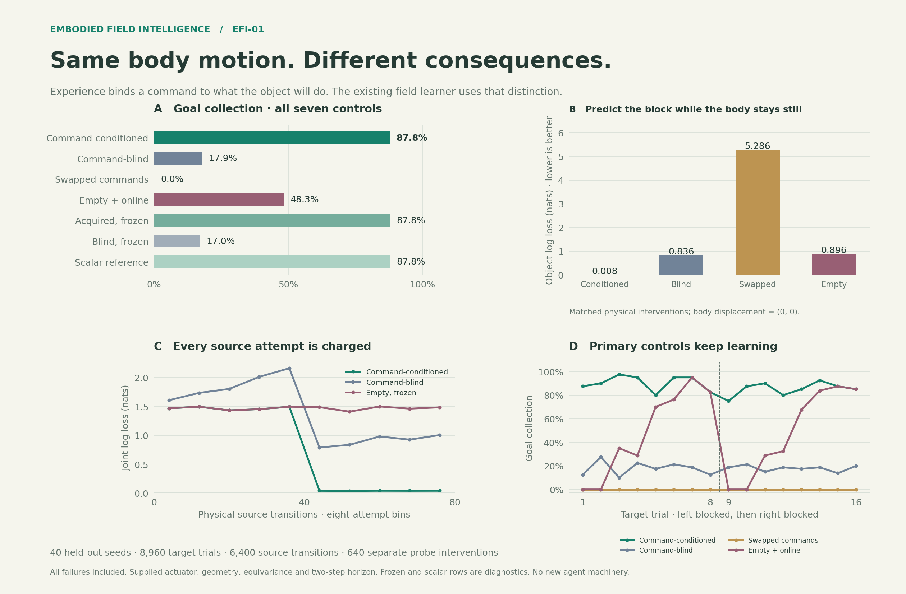

# Learning what a command changes

This experiment tests whether the existing field learner acquires **command-specific
object consequences**, even when the commands produce identical body motion.
The experiment adds a contact world, common-stream controls, and an
auditable evaluation. It introduces no new agent, learned representation,
or controller rule. This is a stronger demonstration of the current
substrate's capability, and the basis for the
[returning-context memory](CONTEXT_MEMORY.md) experiment.

Across **40 held-out seeds and 8,960 target trials**, acquired command-specific
evidence achieved **87.81%** goal collection, versus **17.89%** with commands
pooled, **0%** with the two learned command bindings swapped, and **48.28%**
with source evidence erased. All four principal controls continued learning.
The behavior and matched-feedback prediction gates passed.

| Target control | Success | Mean return | First target trial |
|---|---:|---:|---:|
| Conditioned + online | 87.81% | +0.858 | 87.50% |
| Command-blind + online | 17.89% | +0.159 | 12.50% |
| Swapped commands + online | 0.00% | -0.020 | 0.00% |
| Empty + online | 48.28% | +0.463 | 0.00% |
| Acquired, frozen (diagnostic) | 87.81% | +0.858 | 87.50% |
| Blind, frozen (diagnostic) | 17.03% | +0.150 | 12.50% |
| Scalar reference (diagnostic) | 87.81% | +0.858 | 87.50% |

Each row contains 1,280 trials. The first-trial column contains 80 trials,
one per law/seed, before target learning. Paired success gains are
**+69.92 percentage points [67.58, 72.27]** over command blindness,
**+87.81 [85.47, 90.00]** over swapped commands, and
**+39.53 [37.42, 41.56]** over empty evidence (95% seed-bootstrap intervals).

The acquired frozen diagnostic ties the online learner here: source evidence
already suffices for this stationary task family. This does not demonstrate
an additional benefit from target updates in the acquired learner. The scalar
reference reproduces every action and outcome; maximum policy difference is
4.14×10⁻³⁵.

| Law / blocked side | Conditioned | Command-blind | Swapped | Empty |
|---|---:|---:|---:|---:|
| aligned/left blocked | 90.31% | 19.38% | 0.00% | 48.44% |
| aligned/right blocked | 85.31% | 17.50% | 0.00% | 48.44% |
| reversed/left blocked | 90.31% | 16.25% | 0.00% | 48.44% |
| reversed/right blocked | 85.31% | 18.44% | 0.00% | 47.81% |

Both laws require opposite commands for the same arrangement. Their paired
conditioned results happen to match because the physical scenes, learned
evidence strength, and subsequent motor sampling are symmetric. They are
not additional independent samples beyond the 40 seed clusters.



## Watch a command cause a reaction

[Open the narrated replay](assets/interactive/command_contact.html) in the
**original EFI viewer**. Download the HTML and open it locally when browsing
GitHub. The player works offline; the learning happened during recording.
For a longer continuous illustration of the earlier contact world, use the
[180-move example](assets/interactive/interaction_long.html).

The white **A** is the body. Blue **B** is the block. Green outlines mark a
goal beneath the block. In this world, a lateral command operates a nearby
actuator: the body holds still while the block attempts a one-cell move.
The actuator's hidden wiring either follows or reverses the command.
One side of the block is walled off. Clearing the block and then stepping
forward collects the goal in two physical steps.

Watch **the arrow, then the block**, rather than treating every arrow as a
body movement. The narration names the selected command, actual body and
block feedback, and the probability assigned before learning from that
feedback. The goal/object fields show remembered local observations;
`ObjectFuture` shows the planner's predicted block position under its actual
contingent policy. World display and wiring captions are evaluator truth,
not additional agent inputs. Source commands are forced experiments; their
displayed policy is advisory.

Chapter buttons jump between separate scenes. The recording was selected
before outcomes: both open-context lateral source attempts from repetition
one, then the first two target trials of both layouts for conditioned and
command-blind learners, for both laws on seed 21000. Other acquisition
attempts are omitted and labeled. Every selected failure remains visible.
Spatial memory resets between trials; empirical evidence persists within
each learner. This recording does not show an uninterrupted lifetime or
retention across changing laws.

## What is supplied, and what is learned

| Supplied structure | Acquired through actual feedback |
|---|---|
| Five directional command indices and a lateral actuator in the environment | Which command produces which joint body/object effect |
| Body support: move one commanded cell or stay; object support: one cardinal cell or stay | Whether this contact leaves the block still or moves it laterally |
| 5×5 local sensing, reliable body displacement, one isolated object channel | Effect probabilities from successive local sightings |
| Wall exclusion, a visible goal, rotation-equivariant coordinates | Command preference using acquired evidence in a rearranged reward scene |
| Sixteen wall contexts, 25 joint effects, two-step planning | Empirical counts; representations and horizon remain fixed |

The environment may know its wiring, body/object coordinates, and actuator
branch. The agent receives **only the existing observation window and body
displacement**. It associates object movement from observations, rather than
being given the evaluator's object-displacement label. The same controller
class handles both response laws and all controls.

The learner already has a 16×5×25 table: **2,000 float32 counts, 8,000 bytes**.
A complete real transition decays the applicable row by 0.95 and adds one
observation. The symmetric prior is 0.01 per effect. Versioned rules spread
for two declared local passes; the working port remains 9×9 within a 31×31
map. Each two-step decision evaluates 15,750 joint outcome terms. Neither
rollout nor rule transport can manufacture empirical evidence.

## Protocol and controls

The [protocol](EFI01_PROTOCOL.md) was written before development runs. Ten
development seeds, 11000–11009, preceded a locked evaluation on 40 disjoint
seeds, 21000–21039. No agent parameters or acceptance thresholds changed
after development. Behavioral tests and resource runs use separate seeds.
The result archive records the protocol hash, source hashes, and base Git
revision.

Each seed acquires the two laws **independently**. Acquisition uses two
balanced repetitions of eight local wall contexts × five commands: **80
physical transitions per model**, including backward moves, waits, and
blocked contacts. There is no source reward. Conditioned, command-blind,
and empty diagnostic observers all receive the **same physical stream**.
Predictions are saved before action and scored before updating. The first
two observers acquire bit-identical raw count tables; command blindness
averages the command axis when publishing the table. The empty source
observer is frozen.

Target agents start from that acquired evidence, or its stated intervention.
They attempt eight trials with a wall on the block's left, then eight with
the wall on its right. An additional front wall alternates; orientation
rotates and room sizes vary among 9×9, 11×11, and 13×13. Evidence carries
through these target trials; spatial memory resets. Goal paint is new, but
the target's local wall contexts were covered by acquisition. This tests
reuse under changed reward placement and arrangement, not unseen local
geometry or an invented motor primitive.

| Control | Source evidence at target start | Target updates |
|---|---|---|
| Conditioned | Acquired, command-specific | On |
| Command-blind | Same counts, pooled across commands when queried | On |
| Swapped commands | Only the two lateral command rows exchanged | On |
| Empty | Source records erased | On |
| Acquired, frozen | Acquired, command-specific | Off; diagnostic |
| Blind, frozen | Acquired, command-pooled | Off; diagnostic |
| Scalar reference | Acquired; independent scalar continuation reduction | On; numerical diagnostic |

All use the same capacity, prior, temperature, motor support, rule transport,
and two-step budget. The empty and shuffled controls are charged the same
source exposure as the learner. The scalar reference checks numerical
agreement; it is not an independent architectural baseline.

## Isolate knowledge of the command

For each law/seed, fresh frozen source models predict both lateral commands
in four target contexts. These **eight matched interventions** produce the
same body displacement, `(0, 0)`, from identical starting observations, but
different object effects. All prediction controls observe the same actual
interventions. These probes never train the target agents.

We score both joint log loss and object log loss **conditional on the actual
stationary body**. An improvement on the latter cannot be explained by
better prediction of body movement. Swapping only the two acquired command
bindings also reverses the useful action preference in the identical scene,
under all four tested rotations. This intervention changes stored evidence,
not the world or a supplied response label.

The behavioral gate requires at least a ten-percentage-point advantage over
both command-blind and swapped controls, with positive lower paired 95%
limits. Both held-out prediction losses must also improve with positive
paired limits. Bootstrap resamples use **seeds as clusters**, retaining both
laws, layouts, and repeated trials together: 10,000 samples, RNG 29. The
stronger empty control receives an additional reported comparison.

## Prediction, acquisition costs, and failures

| Frozen common-stream predictor | Joint log loss | Object loss given stationary body |
|---|---:|---:|
| Conditioned | 0.0252 | 0.0076 |
| Command-blind | 0.8578 | 0.8360 |
| Swapped commands | 5.3033 | 5.2857 |
| Empty | 1.7777 | 0.8959 |

All **320 matched command pairs** had identical stationary body feedback and
different object effects. Against command pooling, the loss reductions were
0.8326 nats jointly and 0.8283 nats for the object conditional on the body;
against swapped bindings, both reductions were 5.2781 nats. The seed-bootstrap
intervals collapse to those values because balanced acquisition gives each
seed identical final local counts. They establish consistency within this
deterministic task family, not uncertainty over a broader class of physics.

Acquisition costs **80 transitions per model**, including **48 contact
attempts, 32 blocked attempts, and 32 lateral actuator attempts**. All
interventions cost −0.01, so source return is −0.80 per model. Across the
80 independently acquired law/seed models, this is 6,400 physical source
transitions and 19,200 observer predictions. Every source prediction has
complete local feedback. The separate diagnostic budget is 640 physical
interventions and 2,560 frozen predictions. Targets add 17,920 physical
steps across all seven controls. Source cost is reported separately from
the target-return table and charged equally to every control.

| Source repetition · 40 transitions each | Conditioned | Command-blind | Empty, frozen |
|---|---:|---:|---:|
| 1 | 1.4679 | 1.8634 | 1.4679 |
| 2 | 0.0377 | 0.9060 | 1.4679 |

These are pre-update joint losses in nats. The first repetition is cold
for each context/command; the second tests the single earlier observation.
The figure retains the full source and target learning curves.

**Failures remain part of the result.** The conditioned learner missed 156
of 1,280 goals despite clearing the object on its first command every time.
Its fixed two-step receding horizon still assigns value to waiting and
collecting on a later imagined move; the soft policy sometimes waits on the
last permitted physical step. The agent is not given an episode countdown.
This is a deadline/planning limitation, preserved rather than tuned away
after seeing held-out outcomes.

The empty learner starts at 0% first-trial success but catches up within
each local context. It outperforms command pooling overall, showing that
aliased acquired evidence can be worse than starting empty. Swapped commands
fail all 1,280 trials despite 2,560 actual evidence updates: incorrect prior
bindings continue attracting blocked commands during this short budget.
This motivates choosing actions for the information they reveal; it
does not show that existing online updating always recovers from wrong
knowledge. No control collides; this world contains no hazards, so that
zero is not evidence for safety around hazards.

## Resources and preservation

Measured on an **AMD Ryzen 9 7950X3D**, Python 3.10.20, NumPy 2.2.6,
with one BLAS/OMP numerical worker and no GPU:

| Measurement | Observed | Predeclared limit |
|---|---:|---:|
| Decision + feedback/learning, p50 | 3.18 ms | Reported |
| Decision + feedback/learning, p95 | 3.40 ms | 50 ms |
| Decision + feedback/learning, p99 | 3.68 ms | 100 ms |
| Peak allocation during acquisition | 15.91 MiB | 32 MiB |
| Peak allocation during normal target operation | 16.61 MiB | 32 MiB |
| Peak allocation with every rule-cache site filled | 22.67 MiB | 32 MiB |
| Peak incremental process RSS | 21.92 MiB | 96 MiB |

Timing covers 800 physical ticks across 400 trials, after 25 warmup trials
per law. It includes planning, sampling, sensing/feedback ingestion, scoring,
learning, gathering, publication, and rule transport. Environment stepping,
reset, recording, and JSON serialization are excluded. Reset plus first
observation has p95 1.41 ms; source transitions including reset have p95
4.68 ms per conditioned observer. The two measured agent constructions took
0.88 and 4.42 ms. These are measurements on this CPU, not hardware-independent
guarantees or microcontroller measurements.

Allocation tracing runs in a separate fresh process, including scratch,
environment, and harness overhead. Imports occupied 75.60 MiB of process RSS
before the first agent; the 21.92 MiB figure is incremental, not total process
memory. Saturating rule caches stresses storage without adding learned
experience. The 32-record history and 15,750-term decision bound hold. Rule
transport copies at most 2,320,000 bytes per measured target tick and
15,376,000 bytes in the saturated-cache check. All four resource gates pass.

**Preservation passed:** 266 existing tests before the extension; 276 tests
and the same four expected failures afterward. The ten new checks exercise
matched body feedback, rotations, common-stream acquisition, binding
interventions, frozen diagnostics, and real versus imagined updates.
An additional focused pass after presentation cleanup passed all 12
command-contact/viewer tests.

| Paired before/after archive | Target episodes | Source records | Result |
|---|---:|---:|---|
| Foraging | 212 | — | Identical |
| Crossing | 4,800 | — | Identical |
| Motion transfer | 7,680 | 400 | Identical |
| Original contact | 20,160 | 9,600 | Identical after excluding timing |

The comparison retains every serialized behavioral/model field. Only
`latency_ms` and `latency_ms_percentiles` are excluded from the original
contact comparison. All previously existing agent, core, environment,
evaluation, and viewer sources retain their baseline hashes. CLI registration
is the only change to an existing executable file.

The original viewer was checked at desktop and 390-pixel mobile widths:
all 56 recorded policies, commands, narration, prediction scores, and value
bounds match its embedded payload; playback, seeking, chapter jumps, policy
toggling, zoom, and pinned probes work, with six visible field panels,
no horizontal mobile overflow, and no browser warnings or errors.
Presentation cleanup and a default-world-constructor correction followed
the measured run; no physical law, controller, scoring rule, or threshold
changed. A first-seed replay reproduces all 224 target trials, 160 source
transitions, 16 diagnostic interventions, and 56 recorded frames exactly
apart from execution timing. The original evaluator/world sources and
before/after hashes are retained with the validation archive.

The new experiment is opt-in. The older controllers, world laws, evaluations,
and viewer remain executable. Matching their results establishes preservation
of those paths; it does not establish that the contact learner has absorbed
their navigation or motion-transfer competence. The controllers remain separate.

## Reproduce and inspect

```bash
export OPENBLAS_NUM_THREADS=1 OMP_NUM_THREADS=1 MPLBACKEND=Agg

# Development; use these seeds for implementation choices.
python cli.py command-contact --seeds 10 --seed 11000 --out runs/command-dev

# Locked evaluation. All controls and failed trials are retained.
python cli.py command-contact --seeds 40 --episodes 8 --acquisition 2 \
  --seed 21000 --out runs/command-contact

# Run alone, after other benchmarks finish.
python cli.py command-profile --episodes 400 --out runs/command-contact/profile.json

python scripts/analyze_command_contact.py runs/command-contact/results.json \
  --out runs/command-contact/analysis.json
python scripts/plot_command_contact.py runs/command-contact/results.json
python -m pytest -q
```

The experiment writes complete `results.json`, `summary.json`, and the
original viewer's `episode.json` and standalone `episode.html`. A smoke run
can use `--seeds 1 --episodes 2 --seed 31010`; it is not a held-out estimate.

Archived evidence: [all trials and models](assets/data/command_contact/results.json),
[paired summaries and learning curves](assets/data/command_contact/summary.json),
[cost and mechanism analysis](assets/data/command_contact/analysis.json),
[development summary](assets/data/command_contact/development.json),
[CPU/memory profile](assets/data/command_contact/profile.json),
[preservation record](assets/data/command_contact/validation.json),
[recording](assets/data/command_contact/episode.json), and
[print-quality figure](assets/images/command_contact.pdf).

## What this shows

This experiment supplies evidence that command-specific physical experience changes
useful behavior independently of body displacement. It strengthens the
case for building on the existing substrate without increasing its cognitive
machinery.

It does not establish general causal discovery, spontaneous motor invention,
long-horizon planning, a learned representation, recurring-context retention,
or superiority to other AI architectures. The supplied task family is small
and deterministic; orientation equivariance and local feature distinctions
are designed. Forty seeds vary exposure order, orientation, decoration, and
policy sampling, not forty unrelated physical laws. Prediction intervals
can collapse because all models finish with the same balanced evidence.

The follow-up [returning-context memory](CONTEXT_MEMORY.md) experiment tests
whether useful knowledge can be preserved and recovered when a previous
response context returns, while the agent continues to adapt.
