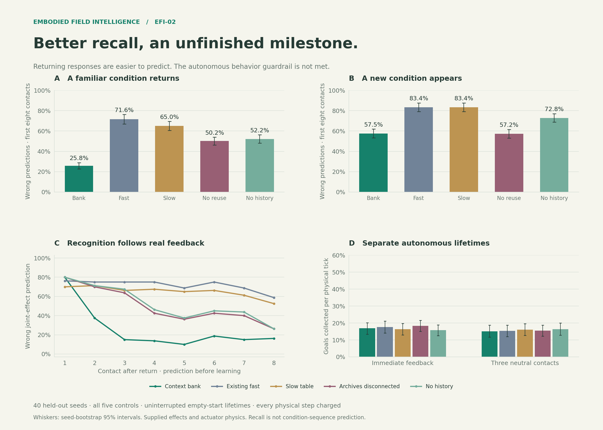
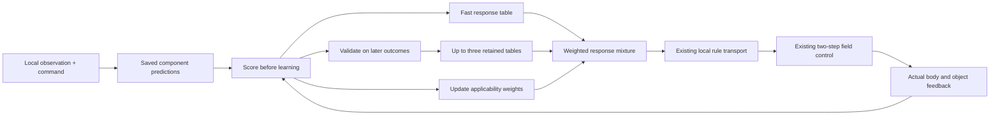
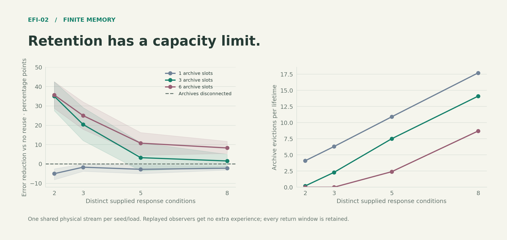
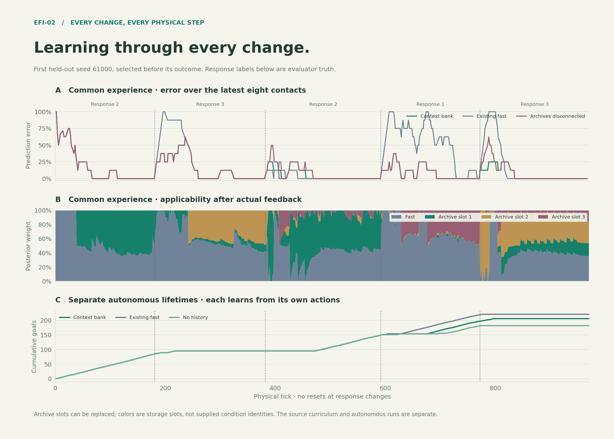

# EFI-02: Recognizing a returning response

**Experiment complete; EFI-02's behavioral acceptance gate remains open.**
The bounded bank reduces wrong predictions after a response returns by
**64.0% relative to the existing fast table**, across 40 held-out seeds.
It passes the declared new-condition adaptation, mechanism, capacity-coverage,
and CPU/memory checks. It does **not** establish autonomous behavioral
noninferiority, so this is not yet a demonstrated EFI-02 capability.
Existing controllers and their executable defaults remain preserved.

## Held-out results

These are all five controls on the same physical prediction streams and
separate uninterrupted autonomous lifetimes. Error columns score the first
eight contacts per relevant segment, before learning from each outcome.
Collection rates average each seed's goals per physical tick.

| Controller | Return errors | Later-new errors | Return log loss | Autonomous collection rate |
|---|---:|---:|---:|---:|
| Context bank | 25.78% | 57.50% | 0.985 nats | 16.85% |
| Existing fast | 71.56% | 83.44% | 1.688 nats | 17.57% |
| Slow table | 65.00% | 83.44% | 1.562 nats | 16.34% |
| Archives disconnected | 50.16% | 57.19% | 2.381 nats | 18.37% |
| No history | 52.19% | 72.81% | 1.309 nats | 15.77% |

The bank improves returning-condition error by **45.78 percentage points**
versus the existing fast table (paired 95% interval **39.53–52.03**) and
**24.38 points** versus the equally fast memory ablation (**19.84–28.91**).
That second comparison isolates a benefit beyond increasing the learning
rate. Return log loss also improves versus the existing fast model by
0.703 nats (0.583–0.815).

On new conditions, the bank's error excess over the equally fast ablation
is 0.31 points, with an upper paired limit of **0.78 points**, inside the
predeclared 5-point margin. Its log-loss excess is 0.149 nats, upper limit
**0.160**, inside the 0.25-nat margin. All methods have 47.50% error in the
initial cold window. Nothing here implies knowledge before exposure.

**The behavioral guardrail fails.** Bank-minus-fast collection rate is
−0.71 points, with paired interval **−3.04 to +1.72**; acceptance required
a lower limit of at least −2.00 points. The mean loss itself is smaller than
the margin, and the interval includes zero. This is failure to establish
noninferiority, not proof that the true average regression exceeds 2 points.
The equally fast memory ablation has the best mean autonomous rate, 18.37%.
Better common-stream prediction is therefore insufficient to claim better
acting.



With three neutral contacts after a switch, return-window error is 37.50%
for the bank versus 67.19% for the existing fast table. Over the first eight
contacts *after* that neutral interval, it is 26.25% versus 67.97%. Delayed
collection rates are 15.13% versus 15.34%, with paired difference interval
−1.83 to +1.50 points. That separately reported stress result does not rescue
the failed primary immediate-feedback behavior gate.

## What changes in the agent

EFI-01 learns what a command does in a local geometry. Its single table
continually overwrites older evidence. EFI-02 keeps a fast table and up to
three acquired alternatives. Actual body/object feedback changes their
applicability weights. When a familiar response returns, an older model can
become useful again before the fast table has relearned every command.
One feedback event can change predictions for other commands because the
applicability weights link the rows within each archived model. The
invariant tests isolate this effect without adding evidence to those rows.

This is a small mixture of categorical response tables. The new capability
is retaining and recognizing alternatives across time. Geometry categories,
motor primitives, motion support, and rotation symmetry are supplied. It
does not learn a condition chain, invent categories, infer another agent's
intentions, or predict an unannounced switch before distinguishing evidence.



The fast table uses per-row retention 0.1. Before a query, posterior weights
mix 80% previous applicability with 20% background probability; the background
assigns half to the fast model and half across active archives. Every
component is conditioned on the same locally known legal outcomes. The
saved pre-action component predictions determine posterior responsibility
when real feedback arrives. Conditioning the published mixture on geometry
also changes the effective component weights through their legal probability
mass; the tests verify that captured components reconstruct the actual
saved prediction. Slow archive updates require both applicability
and support for the outcome predicted *before* that update.

An archive is admitted only after eight sufficiently accurate prequential
fast-model predictions and separation from existing supported predictions.
It copies actual acquired counts; it does not add physical observations.
At capacity, the least-used archive is replaced. Archives can contain mixed
or incomplete response knowledge; there is no guarantee of one clean slot
per hidden condition. Repeated mistakes, allocation, and evictions are
included in the records.

Only the mixed table enters the existing spatial rule field. The bank is
bounded body-local memory, not a global world model. The existing 5×5
sensing window, 31×31 internal map, two transport passes, two-step planning
horizon, and five physical commands remain. Imagination freezes the mixture
and cannot update empirical counts. Missing object feedback may change
applicability through body evidence, but cannot create joint-effect support.

## Experiment and controls

The [protocol](EFI02_PROTOCOL.md) was written before development; its dated
amendment records the failed initial configuration and parameter selection
using ten development seeds. Forty disjoint held-out seeds run continuously
through A–B–A–C–B. The three supplied actuator responses are randomly assigned
to A/B/C, and segment durations vary from 160 to 224 physical ticks. Body,
block, field memory, and evidence never reset at a switch. Only the evaluator
knows the hidden response labels and schedule.

A block covers goal paint. Contact commands can move the block while holding
the body still; entering the exposed goal collects it. New paint then appears
under the block. This supplies repeated opportunities in one lifetime.
The planner uses currently observed paint and does not model its future
replenishment. A separate delayed condition inserts three neutral contacts
after each change, with no neutral-interval flag supplied to the learner.

| Controller | Retained alternatives | Query history | Fast-row retention |
|---|---|---|---:|
| Context bank | Three bounded archives | Feedback-weighted | 0.1 |
| Existing fast | None | One current table | 0.95 |
| Slow table | None | One current table | 0.995 |
| Archives disconnected | Same bank bookkeeping | Publishes fast table only | 0.1 |
| No history | Same bounded bank | Fixed fast share; uniform active-archive share | 0.1 |

All five prediction observers receive the same real physical stream. A
declared external acquisition policy makes balanced local attempts and
physically detours after blockage. Its small local search is evaluation
machinery, not part of the EFI agent. Every failed attempt and detour counts.
These observers use one-step fields because their actions are forced.

Separate autonomous lifetimes start with empty evidence and use two-step
fields. Every controller chooses its own actions. Identical seeds match
world schedules, not visited states or experience. No common-stream,
capacity, or diagnostic knowledge is copied into these lifetimes.

## Evidence and limits

The primary retention metric counts wrong joint-effect predictions on the
first eight contacts after a condition returns. The declared target is at
least 25% relative improvement over the existing fast table, with a positive
paired 95% interval, plus improvement over the equally fast memory ablation.
New-condition adaptation and complete-lifetime behavior have independent
noninferiority limits. Bootstrap units are seeds, keeping each seed's
correlated transitions together.

Capacity stress varies 2/3/5/8 distinct supplied responses against 1/3/6
archive slots. Each condition is encountered and later returns. A single
physical stream per seed/load supplies all capacity observers; verified
schema replay avoids repeating identical field work. This measures memory
prediction and storage, not new behavior or free additional experience.

The held-out capacity study includes ten independent seeds per load, 40
physical streams, and 240 replayed observers. All return windows contain
at least eight contacts. Wrong-prediction rates are:

| Distinct responses | One archive | Three archives | Six archives | Archives disconnected |
|---:|---:|---:|---:|---:|
| 2 | 63.75% | 23.75% | 23.13% | 58.75% |
| 3 | 56.25% | 34.17% | 29.58% | 54.58% |
| 5 | 47.50% | 41.50% | 34.00% | 44.75% |
| 8 | 38.75% | 35.00% | 28.28% | 36.56% |

With three slots, the paired error advantage is clear for two or three
responses, but its interval includes zero at five and eight. One slot can
hurt: with two responses it produces **5.00 points more error** than
publishing the fast table alone (95% interval 2.50–8.13). Six slots retain
an advantage at eight responses, despite averaging 8.7 evictions per
lifetime. Archives are partial models, not exact condition identities.
Changing the response family also changes task difficulty, so compare
against the matched control at each load rather than reading raw error
across loads as a pure capacity effect.



The table-array budgets are 16,025 / 32,059 / 56,110 bytes for one / three /
six slots, including the fast model and weight arrays. Bounded Python
history and transient work are additional; the full resource gate measures
the default three-slot controller. The capacity archive includes every
allocation/eviction event and all windows, including negative results.

The archive-content diagnostic holds the scene and applicability weights
fixed while preserving, swapping, or erasing acquired archive contents. It
isolates whether retained knowledge reaches useful action preferences.
It explicitly installs an archive from 80 real source steps and does not
by itself demonstrate recognition or archive admission.

This world is a narrow deterministic actuator family with categorical
geometry, one associated block, and a small map. These experiments do not
establish noisy-context robustness, broad causal abstraction, state-of-the-art
performance, or unified competence across EFI's earlier tasks. The same
mixture mechanism could be used outside a field controller; this experiment
tests retention within EFI, not an advantage caused by the spatial substrate.

## Resources, preservation, and the remaining question

On an **AMD Ryzen 9 7950X3D 16-Core Processor**, one numerical worker, no GPU,
2,841 complete decision-plus-feedback/learning ticks across three lifetimes:
**p95 4.33 ms; p99 4.75 ms**.
Peak traced allocation, including saturated caches, is **22.73 MiB**;
peak incremental RSS is **21.91 MiB**.
All declared resource limits pass. Timing includes initial learning ticks;
construction is reported separately. Main-benchmark timings were collected
under concurrent evaluation and are not used for these resource claims.

The full suite passes **285 tests with four expected failures**, versus
276 plus four before this work. Supplemental checks extend recognition to
an untried command row and run the locality check through actual learning.
The final nine EFI-02 tests also pass. Existing CLI demo and Gym registration
smoke checks pass.

The full EFI-01 archive reproduces **8,960 target trials, 6,400 source
transitions, 640 probes, and 80 learned models** exactly, excluding timing
fields. All preexisting agent, core, world, evaluation, and test sources
retain their baseline hashes; the existing CLI only gains opt-in commands.
Earlier foraging, crossing, transfer, and contact paths remain unchanged.
This establishes preservation of those separate paths, not competence of
one integrated successor on every earlier task.

The descriptive [trajectory analysis](assets/data/context_memory/analysis.json)
shows 10 primary seeds with more collections than `fast`, 14 ties, and 16
with fewer. The bank's mean longest contact-free interval is 404.9 ticks;
the existing fast model's is 416.2. Longest consecutive waits average fewer
than four ticks in both. The shortfall is not simply a policy that refuses
to move. Of the bank's 80 autonomous return segments, 33 have fewer than eight contact
opportunities; every common-stream segment meets that coverage. The bank
loses ground mainly in the last two segments. These are
different trajectories; the analysis does not identify a causal mechanism.

A concrete next hypothesis is that globally weighted archives can dilute
useful fast predictions in command/context rows with little archived
support. That is visible in the current mixture definition, but its role
in the behavioral losses is **unproven**. The next EFI-02 effort should
replay the divergent decisions, test bounded support weighting on development
seeds, and preregister fresh held-out seeds before another acceptance run.
Keep this failed result and the same behavioral margin. More memory alone
is not an established remedy, and EFI-03 remains dependent on an unfinished
capability.

The original-viewer recording contains all **972 frames** of seed
61000's first bank lifetime, including its 206 collections and failures.
It was selected before its outcome, not selected for success.

## Reproduce

Run from the repository root after installation. Full evaluation may use
several independent seed processes; measure per-agent resources separately
with one numerical worker after the experiments finish.

```bash
# Quick complete lifetime and all controls; development/test seed, not held-out
python cli.py context-memory --seeds 1 --seed 71020 --out runs/context-smoke

# Full held-out experiment and prospectively selected original-viewer replay
OPENBLAS_NUM_THREADS=1 OMP_NUM_THREADS=1 python cli.py context-memory \
  --seeds 40 --seed 61000 --workers 4 --out runs/context-memory

# Separate held-out memory-capacity experiment
OPENBLAS_NUM_THREADS=1 OMP_NUM_THREADS=1 python cli.py context-capacity \
  --seeds 10 --seed 62000 --out runs/context-memory

# Run alone after evaluation finishes
OPENBLAS_NUM_THREADS=1 OMP_NUM_THREADS=1 python cli.py context-profile \
  --lifetimes 3 --out runs/context-memory/profile.json

python scripts/plot_context_memory.py runs/context-memory
python -m pytest -q
```

`results.json.gz` contains every common physical step and autonomous lifetime;
`capacity.json.gz` contains all capacity streams, replays, and return windows.
Summaries are ordinary JSON. The replay uses the original standalone HTML
viewer; playback displays recorded learning rather than training again.

## Reading the full replay

Open the [original-viewer lifetime](assets/interactive/context_memory.html).
On GitHub, download the raw HTML and open it locally. It works offline.
The five chapter buttons mark response changes; the body and its evidence
continue through every chapter. The phase captions are evaluator truth.

The white A is the body; the blue B is the block covering goal paint. The
arrow shows the selected command, which can move the block while the body
stays still. Step forward once to read the resulting body/object feedback.
The six panels are the original observed-goal, observed-object, action-value,
unresolved-probability, object-forecast, and next-body fields.

The narration reports the actual outcome's probability **before learning**,
the number of real evidence updates, and next-query weights for the fast
model and archive slots. The empirical-support strip is the fast table's
decayed count mass, not the total number of real observations or all archive
contents. The timeline figure uses posterior weights after feedback; query
weights also include the declared background mixture. A slot's color is
storage location, not a hidden response identity. Eviction can replace it.



## Data and audit

[Locked protocol](EFI02_PROTOCOL.md) ·
[Summary and paired intervals](assets/data/context_memory/summary.json) ·
[Complete physical streams and lifetimes](assets/data/context_memory/results.json.gz) ·
[Complete capacity study](assets/data/context_memory/capacity.json.gz) ·
[Resource profile](assets/data/context_memory/profile.json) ·
[Archive intervention](assets/data/context_memory/intervention.json) ·
[Validation record](assets/data/context_memory/validation.json).

The data directory also retains the initial failed development configuration,
both parameter searches, the final development run, and capacity development
results. Development metadata predates final formatting and parallel-harness
cleanup; the held-out archive identifies the locked implementation commit
and exact source/protocol hashes. No held-out outcome was used to change the
implemented controller or an acceptance margin. Validation distinguishes
**evidence integrity** from **capability acceptance**: an audited negative
result does not become a passing capability.
