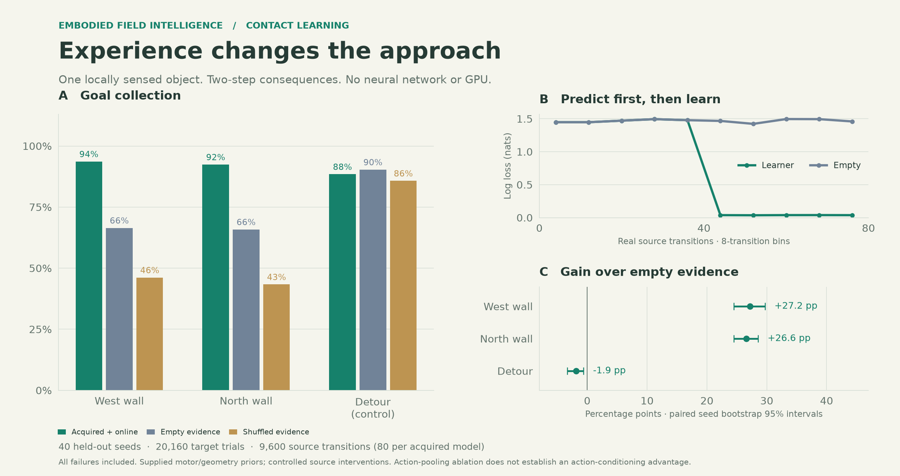
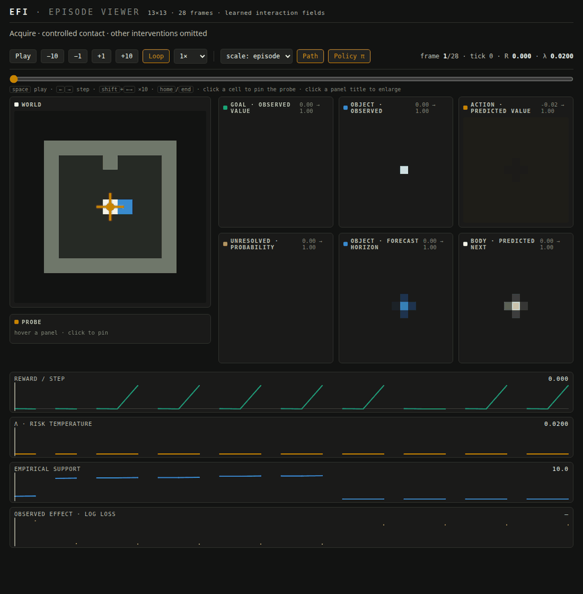
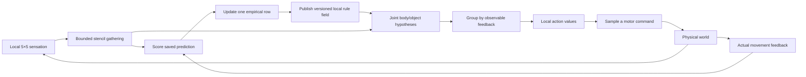

# Learning what contact will do

EFI can now learn how contact changes an object's position, then use that
experience to choose an approach in a rearranged local scene. The new
`InteractionFieldController` predicts **joint body/object consequences** of
commands, learns only from actual feedback, and evaluates two physical
steps through bounded local fields and co-located hypothesis channels.

This implements the first contact pilot in the
[online intelligence design](ONLINE_INTELLIGENCE_DESIGN.md). It is an opt-in
research capability. Recurring-context retention, composition of two
independently learned skills, and integration into the earlier navigation
controllers remain open milestones.

Across 40 held-out seeds, acquired evidence plus continued online learning
collects goals in **93.65% / 92.40%** of the two contact arrangements, versus
**66.46% / 65.83%** with empty evidence. This is a narrow, controlled result
about acquiring and using contact knowledge. The complete ablation table
below includes controls that outperform the new learner.



## Watch the original viewer

[Open the interactive replay](assets/interactive/interaction.html).
It is the existing EFI episode viewer, extended with additional field types;
its layout, color ramps, transport controls, zoom, synchronized probe, and
telemetry strips are reused.



The recording includes two prospectively selected source contacts, then
the first two target trials in each contact arrangement for the acquired
and empty controls. Source interventions between those contacts are omitted
and explicitly labeled. Every selected target attempt is included, regardless
of outcome. These are separate scenes, not a continuous episode; paths and
telemetry lines break at scene boundaries.

The white cell is the body; blue is the object. A green outline marks goal
paint beneath the object. The fields show locally observed goals and objects,
action values, unresolved probability, the object's predicted position at
the planning horizon, and the body's next-position distribution. Forecasts
come from the actual planner and its feedback-contingent policy. Unresolved
mass stays absent from those distributions. Policy arrows use the recorded
five-action probabilities, including a circle for waiting; a terminal frame
has no policy. Source commands are controlled interventions, so their
recorded policy is advisory rather than the forced command.

The world panel uses evaluation truth for explanation. The agent receives
only its local observation and movement feedback; it cannot read that panel.
Field colors are quantized for display, while policy probabilities and
return bounds remain unquantized in the recording.

## Reproduce

```bash
export OPENBLAS_NUM_THREADS=1 OMP_NUM_THREADS=1 MPLBACKEND=Agg

python cli.py interaction --seeds 40 --episodes 8 --acquisition 2 \
  --seed 10000 --out runs/interaction
python cli.py interaction-profile --episodes 400 --out runs/interaction/profile.json
python scripts/analyze_interaction.py runs/interaction/results.json \
  --out runs/interaction/analysis.json
python scripts/plot_interaction.py runs/interaction/results.json
python scripts/make_viewer_demo.py --html runs/interaction/episode.html \
  --out docs/assets/images/interaction_viewer.gif \
  --every 1 --fps 1.5 --width 1000 --viewport 1100,1120
python -m pytest -q
```

The experiment writes all trials and acquired models to `results.json`,
aggregates to `summary.json`, and the recording to `episode.json` and
`episode.html`. A smoke run can use `--seeds 2 --episodes 2 --seed 0`.
The viewer works offline. GIF capture uses the repository's existing
headless Chrome/Pillow script; the chart uses Matplotlib.

Archived evidence: [raw trials](assets/data/interaction/results.json),
[summary](assets/data/interaction/summary.json),
[analysis](assets/data/interaction/analysis.json),
[CPU/memory profile](assets/data/interaction/profile.json), and
[validation](assets/data/interaction/validation.json).

## What experience changes

One immutable experience record binds a local wall context, the commanded
action, the body-relative object direction, the prediction made before
acting, and the model version that produced it. After the physical action,
reliable displacement feedback and the next local sighting identify the
joint effect. The saved prediction is scored **before** the evidence update.

The learner has 16 adjacent-wall contexts × five commands × 25 joint effects:
**2,000 float32 counts, or 8,000 bytes**. On a complete observation, only the
applicable context/action row decays by 0.95 and receives one observation.
A symmetric pseudocount of 0.01 per effect supplies initial uncertainty.
All representations and capacities are fixed. Counts survive episode resets;
spatial memory resets. A 32-record history bounds retained experience.

Missing object feedback can score the body marginal, but it adds no joint
evidence, model version, or empirical support. An unassociable object motion
is recorded as partial rather than assigned a made-up transition. Hypothetical
rollouts never write to the learner. The experiment has complete feedback
on every source transition; missing-feedback handling is exercised by tests,
not established as a successful partially observed learning capability.

| Supplied by the architecture/task | Learned from physical experience |
|---|---|
| Five motor commands; body moves one commanded cell or stays | Joint displacement probabilities during local interaction |
| Reliable actual displacement sensor and a 5×5 observation | Whether a particular contact moves the object or leaves it blocking the body |
| One isolated object with a known channel; passive beyond contact range | Relative forward, left, or right response within the supplied effect vocabulary |
| Rigid exclusion, walls, one-cell object support, rotation-equivariant coordinates | Counts for each encountered local geometry/action context |
| Visible goal value, collision cost, finite reward range | Pre-action predictive probabilities as evidence accumulates |
| Balanced acquisition commands and two-step planning horizon | Approach preference after inserting acquired evidence into the same computation |

For an identical visible target scene, swapping learned push and left-yield
evidence reverses the preferred first approach. A behavioral test requires
each corresponding action probability to exceed 0.99. Neither the hidden
reaction law nor an approach label enters the controller.

This is reuse across rotation and arrangement, with rotation equivariance
supplied. The target's **local wall contexts were covered during acquisition**.
It does not demonstrate invention of a new effect vocabulary or generalization
to an unseen local contact law.

## Local prediction and action



The body gathers a 9×9 working port from remembered observations through
explicit radius-1 N8 transport. The empirical table is published at the
body's lattice site. Immutable versioned copies spread for two N8 passes.
Future model queries read only the current site or a hypothetical body
position one N4 step away. A cache whose version has not arrived supplies
the factory prior, not a remote lookup of current learned parameters.

The planner keeps body and object positions jointly: five root commands ×
25 effects, then five possible second commands × 25 effects per branch.
These are bounded channels at the body port, not cloned environments or
global map hypotheses. The implementation evaluates 15,750 outcome terms
at horizon two, including zero-mass terms, with no data-dependent tree growth.

Hidden consequences with identical observable feedback share one future
policy. Their action values are averaged before the next soft action
selection. This prevents choosing a different future action using information
that the body could not have observed. A separate scalar dictionary reducer
checks this grouping numerically, including deliberately ambiguous feedback.

Action values use a temperature-scaled log-mean-exp continuation and a
softmax motor distribution. They are regularized model predictions, rather
than exact unregularized episodic returns. The displayed lower/upper bounds
cover unresolved probability **under that model and objective**; they are
not statistical confidence intervals or bounds on errors in the learned law.

Known physical impossibilities can condition the prior. Unknown geometry
instead leaves unresolved probability mass, with finite lower/upper return
bounds based on the supplied reward range. It is not renormalized into
confidence. Collision takes precedence over collection; either terminates
the branch. The two-step boundary is zero: no global distance, oracle value,
or assumed post-horizon path completes the task.

| Operator | Spatial dependency per call | Actual implementation/work |
|---|---|---|
| Fresh evidence gathering | Radius 2, N8 | 40 full spatial/channel shifts along tagged paths |
| Remembered working port | Radius 4, N8 | 240 full spatial/channel shifts along tagged paths |
| Empirical update/publication | Body-local | One 25-effect row; publish one 2,000-value table |
| Versioned rule transport | Two N8 passes | Two bounded payload buffers, one newest-version copy per visited site/pass |
| Hypothetical model query | Radius 1, N4 | Current body or its possible first displacement |
| Joint rollout and feedback grouping | Co-located finite channels | 15,750 effect terms; no remote world reads |

The gather performs **280 shifts**, totaling 1,345,400 float elements at
31×31×5; propagation depth is still at most four cells for each dependency.
Work and light-cone depth are different quantities. Source evidence can
influence a nearby model query after the radius-two binding, two cache
passes, and radius-one read: a conservative composed spatial cone is five.
This is not a single radius-one CA update for the entire decision.

Two deliberate pilot choices differ from the larger design: the cache
payload is the entire small finite table rather than four sparse records,
and joint inference uses a gathered body-local fiber rather than populating
rollout channels at every physical-space cell. Both costs are explicit.
The hypothesis grouping is a bounded reduction over local channels, not a
global field reduction. This implementation does not establish an advantage
over a conventional CPU model-based solver using the same representation.

## Experiment and all controls

Development used seeds 0–9. The fixed evaluation uses seeds 10000–10039,
with three response laws and eight trials per arrangement/contender.
Rooms have side lengths 9, 11, or 13 and all four rotations. Additional
random walls outside the initial observation are generated independently
of the hidden response law. These are small templates, not arbitrary mazes.

Each acquired model receives 80 one-step source transitions: two shuffled
passes over eight valid adjacent-wall contexts and five commands. Sixteen
transitions command contact. There is no source goal or taught approach.
The experimenter supplies balanced interventions; autonomous discovery of
useful experiments is not tested. The empty common-stream predictor sees
the exact same observations and commands, with its counts frozen at zero.

The target begins next to a diagonal object over goal paint. A west or north
wall makes the correct approach depend on the learned contact response.
The detour control instead puts the goal beside the object: contact knowledge
is unnecessary. Every trial has a two-step deadline, a −0.01 step cost, +1
collection reward, and −2 collision cost. No hazards are placed in this pilot;
zero recorded collisions therefore establish no new avoidance capability.

All controllers share sensory inputs, action support, geometry priors,
temperature 0.02, and resource settings except the stated ablations.
Only empirical counts transfer from source. Each contender starts with the
same random seed; different policies can subsequently consume that stream
differently. Spatial memory resets each trial. The online controller retains
target evidence across trials and arrangements in fixed west/north/detour
order; frozen controls preserve their source counts exactly.

| Contender | Evidence and inference | West wall | North wall | Detour |
|---|---|---:|---:|---:|
| `online` | Acquired; keep learning; two steps | 93.65% | 92.40% | 88.44% |
| `frozen` | Acquired; no target updates | 95.63% | 94.06% | 89.79% |
| `empty` | Zero empirical counts; frozen | 66.46% | 65.83% | 90.31% |
| `shuffled` | Permute acquired joint-effect labels; frozen | 46.15% | 43.33% | 85.73% |
| `passive` | Average source counts over commands; frozen | 100.00% | 100.00% | 90.31% |
| `one_step` | Acquired and frozen; one-step horizon | 26.67% | 24.58% | 33.23% |
| `tabular` | Frozen; scalar feedback-group reduction | 95.63% | 94.06% | 89.79% |

There are **20,160 target trials** and **9,600 acquired source transitions**,
plus 9,600 frozen common-stream scoring replays. Each task/mode success rate
contains 960 trials. Source experience is paid once per seed/law and reused
by all acquired contenders. No failed acquisition or target trial is discarded.

Paired bootstrap intervals resample the 40 **seeds**, averaging response
laws and trials within each seed, with 10,000 resamples and RNG 29:

| Online minus control | West wall, percentage points | North wall, percentage points |
|---|---:|---:|
| Empty | +27.19 [24.48, 29.69] | +26.56 [24.48, 28.54] |
| Shuffled | +47.50 [40.52, 54.90] | +49.06 [41.98, 56.35] |

Common-stream pre-action log loss falls from **1.4679 to 0.7528 nats** over
all source transitions. The first source pass encounters each exact
context/action row once, so prediction has no empirical benefit yet. The
second pass measures the benefit of one prior observation of that row.
The abrupt learning-curve change is caused by this balanced schedule;
it is not evidence that the agent independently discovered a new concept
at transition 40.

The first eight contact opportunities have mean loss **1.2588 nats**, equal
to the empty prior. The next eight have **0.0291 nats**, versus the empty
prior's unchanged 1.2588. Half of the contact attempts are blocked in both
passes; learning their failure correctly is part of the task. Every source
step returns −0.01 because acquisition has no goals. Measured learner CPU
cost averages about **46 ms through the eighth contact**, and **103 ms for
all 80 source transitions**; these experiment timings include possible host
contention and exclude the common-stream control's duplicate computation.

The declared A success/prediction threshold is met on the contact
rearrangement family. The detour is a negative control and fails an
advancement claim: online minus empty is **−1.88 points [−3.33, −0.63]**.
Pooling evidence over actions reaches 100% in both contact arrangements,
so this benchmark does **not** establish a need for action-conditioned
memory. Supplied motor support and local geometry already constrain much
of the response. The scalar reducer reproduces frozen behavior exactly;
it is a numerical reference, not an independent architecture comparison.

Continued target learning also loses 1.98 / 1.67 points to frozen evidence
in the two contact tasks. The stationary laws do not test adaptation to
change. One observed failure mechanism is waiting near a reward: repeated
two-step replanning plus a soft policy can defer collection past the world's
deadline, which is not supplied to the agent. More accurate probabilities
need not improve success under that control rule. This limitation was visible
in development; temperature and deadline were kept fixed for evaluation.

## Resources and preservation

The independent profile includes observation, feedback scoring, learning,
gathering, cache transport, planning, and action sampling. It excludes the
environment, episode resets, and rendering. Peak memory is measured in a
fresh process after imports with NumPy/Python allocation tracing, including
planning scratch. A second stress case populates the entire rule-cache field
to expose its worst copying allocation. The fixed-array `nbytes` property
alone is not used as a peak-memory claim.

On an AMD Ryzen 9 7950X3D, Linux x86-64, Python 3.14.4, NumPy 2.5.2, and
one BLAS/OMP thread, 400 episodes / 800 measured ticks give:

| Measurement | Result | Design target |
|---|---:|---:|
| Median decision/update time | 3.11 ms | — |
| p95 / p99 | 3.30 / 3.51 ms | ≤50 / ≤100 ms |
| Normal peak allocated memory | 16.53 MiB | ≤32 MiB |
| Peak with every cache site populated | 22.58 MiB | ≤32 MiB |
| Peak incremental process RSS after imports | 41.28 MiB | ≤96 MiB |
| Unique retained agent arrays after stress | 15.09 MiB | Included in peak |
| Maximum joint-effect terms per decision | 15,750 | ≤16,900 for this pilot |

The resource gate passes on this machine and the default 31×31 internal
map. These are CPU measurements, not a hardware-independent real-time
guarantee. Copying the full two-buffer rule field dominates storage; a
saturated update copies 15,376,000 payload bytes across two transport passes.
Sparse caching is a clear future optimization, rather than a requirement
to invent a larger model.

The full suite passes **263 tests with four expected failures**, up from
240 passing tests with the same four expected failures. Earlier deterministic
evaluation records reproduce **byte for byte**:

| Existing path | Replayed episodes | Result |
|---|---:|---|
| Published-config foraging + egocentric foraging | 212 | Identical serialized metrics |
| Predictive crossing | 4,800 | Identical full results JSON |
| Motion transfer | 7,680 targets + 400 source | Identical full results JSON |

```bash
python scripts/capture_legacy_regression.py runs/regression-forage.json
python cli.py crossing --seeds 20 --episodes 20 --seed 1000 --out runs/regression-crossing
python cli.py transfer --seeds 20 --episodes 12 --acquisition 20 \
  --seed 5000 --out runs/regression-transfer
```

Hashes, software versions, browser checks, and the source-file manifest are
archived in [validation.json](assets/data/interaction/validation.json).
After adding source-cost telemetry, a repeat of the contact evaluation also
preserved every behavioral trial result and aggregate exactly.

Tests cover pre-action scoring, immutable records, partial feedback without
invented joint evidence, final-transition learning, local version propagation,
no-wrap gathering, information-cone invariance, shared policies under hidden
outcomes, scalar reduction agreement, conservative unresolved bounds, terminal
reward accounting, bounded memory/work, rotation reuse, and actual viewer
policy/field payloads.

Preserving earlier code paths is distinct from preserving every earlier
capability in this new controller. The new contact agent has not passed the
design's integrated-successor gate on foraging, crossing, or interception.
It remains opt-in and does not replace their defaults.

## What this opens, and what it does not settle

We now have an executable route from actual action feedback to bounded
evidence, local prediction, and changed action preference. That is a concrete
foundation for the proposed cognitive space. The present effect vocabulary,
geometry features, motor support, and goal interpretation are supplied.
The system has not learned those representations, inferred another agent's
intentions, retained competing response contexts, or composed two separately
learned relations.

The next architectural milestone should add recurring, observably cued
response conditions and test retention against this single fast table.
Before making a composition claim, independently learn a motor relation and
a contact relation, then require both on unseen combinations. A stronger
action-conditioning test should allow different commands to cause distinct
object reactions while holding observed geometry and body displacement
constant. The current passive ablation makes that requirement concrete.
