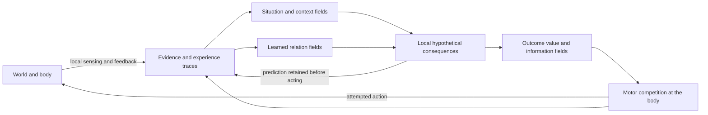

# EFI: a field architecture for accumulating online intelligence

Status: research design, three revision passes and an independent review
complete. The first bounded contact pilot is now implemented; see
[implementation, evidence, and limits](INTERACTION_LEARNING.md).
Recurring-context retention and learned-ingredient composition remain
proposals. See the
[independent review and response](ONLINE_INTELLIGENCE_REVIEW.md).
The implementation baseline is commit `bbb63de` on
`feat/predictive-field-control`.

## 1. Direction and design plan

Build an embodied agent whose experience changes what it can predict and
accomplish, while learning and acting on an ordinary CPU. Preserve EFI's
defining constraint: sensed evidence, memory, predictions, and action
preferences interact through bounded local field operations.

The central proposal is to make a **learned relation between conditions,
actions, and consequences** the reusable unit of intelligence. A relation
should contribute to perception, imagined consequences, useful experiments,
and control through the same interface. Experience should improve that
relation and make it available in another situation.

The work plan for this document is:

1. Ground an initial design in the existing implementation and results.
2. Revise its concepts: define composition, grounding, and what is learned.
3. Revise its mechanisms: resolve locality, uncertainty, credit, and cost.
4. Revise its execution plan: specify bounded experiments and failure gates.

The research target is increasing competence per unit of experience and
computation. It includes adaptation, retention, transfer, useful exploration,
and eventually longer causal chains. A GPU-free implementation alone would
establish none of these. Arbitrarily many unrelated facts cannot be retained
without error in fixed finite memory; retention must be measured against a
declared capacity and stream of experience.

The architecture succeeds as a platform when a newly learned relation can
enter the existing fields, alter action, receive corrective feedback, and
combine with another relation **without a new task-specific controller
branch**. We will still supply sensors, motor primitives, representation
capacity, and learning rules. Learning an arbitrary new software module or
rewiring an unrestricted graph is outside this proposal.

## 2. What we can build on

| Existing component | Evidence and architectural value | Current boundary |
|---|---|---|
| Egocentric beliefs and local value relaxation | Sensing, remembered geometry, and preferences already affect one action field | Mostly physical-space representations; finite map and supplied observation channels |
| Predictive patch schema | Learns observation transitions conditioned on attempted action and aligned movement feedback | Exact-pattern dictionary grows without a capacity limit; its imagination is not the temporal controller's dynamics model |
| Motion and relational motion schemas | Small learned transition statistics support anticipation and reuse across rotations and object roles | Isolated object per channel; shared parameter table; object dynamics independent of the agent's actions |
| Temporal value field | Waiting and movement use predicted arrivals and edge collisions | Exogenous forecasts; marginal encounter approximations and heuristic terminal value |
| Continuous observation/action loop | The agent already experiences consequences of its own movement | Failed motion is largely interpreted as geometry or localization evidence, not a learned family of contact effects |

The strongest recent evidence is immediate reuse of acquired motion in a
new role. Frozen transfer achieved 81.25% success in the combined obstacle
and hazard task versus 49.58% for an empty frozen motion model. Fresh online
learning nearly caught up with transferred online learning, so this is
evidence for initial reuse, not a general superiority claim. See the
[transfer report](PREDICTIVE_TRANSFER.md) and
[predictive control report](PREDICTIVE_CONTROL.md).

Software modules already compose. Learned knowledge composes only in a
limited sense: we supply the observation roles, model family, and most
connections between predictions and control. A new field with a suggestive
name would not by itself advance this.

## 3. Representation: fields of grounded possibilities

Retain a spatial field substrate, with bounded channels at each site for
alternative local interpretations. Use three kinds of persistent content:

- **Situation:** what seems to be present, including observed absence,
  motion, geometry, contact, and uncertainty about recent history.
- **Relation:** a conditional distribution over the effects of an attempted
  action in a local situation. The same physical relation can support an
  appetitive or aversive consequence.
- **Experience trace:** what was predicted before acting, what was attempted,
  what feedback arrived, and which parts remain unobserved.

A relation has the form

```text
local conditions + attempted action + recent context
    -> distribution of body/object changes and observable feedback
```

For example, a forward command near an occupied cell may lead to body
motion, object displacement, neither, or uncertain feedback. “Movable” is a
useful interpretation of learned response probabilities. It is not an
environment-provided label or a Boolean switch selecting a push routine.

Use relative orientation and local geometry to reuse evidence. Bind a
relation to currently sensed or remembered occupants; never import hidden
world identifiers, object laws, task names, or unobserved obstacle maps.
Maintain the distinction between physical dynamics and how outcomes matter
to the agent. A reward change should revalue consequences without rewriting
the learned physics.

Every field declares:

| Property | Required meaning |
|---|---|
| Support and frame | Which substrate sites and coordinate frame it describes |
| Units | Probability, evidence count, expected outcome, cost, or activation |
| Time | Observation time, current belief time, or prediction horizon |
| Provenance | Direct observation, inference, or imagination |
| Uncertainty | Unobserved, stochastic, model-ambiguous, or stale |
| Lifetime | Transient activation, episode memory, or persistent learning |

Probability mass is not arbitrary activation. A value field is not sensory
evidence. Imagined outcomes must never become observations through repeated
field relaxation.

### 3.1 Physical location is only one coordinate

Use physical-space sheets for geometry and situated beliefs. At each site,
bounded additional channels describe possible relations, context, and
effects. Call this collection a **local fiber**: a small finite state space
attached to a lattice site. Operations may mix channels at that site;
communication between sites follows declared stencils.

Two distant places with similar geometry are not adjacent merely because
they have similar descriptors. Reuse requires transporting a learned rule
to a new binding. Conversely, several interpretations of one contact are
co-located and can compete without moving across the map. This distinction
keeps semantic similarity from becoming an undeclared communication channel.

Retain one physical lattice and bounded fibers for the first milestone.
Defer additional abstract sheets and multiscale spatial maps until an
experiment needs them. If a coarse sheet is added, its edges must declare
their physical reach and transport cost; coarse resolution is not free
long-distance communication.

### 3.2 Separate knowledge, binding, and current activation

For one contact relation, keep three distinct things:

```text
learned parameters: how local conditions predict effects of commands
current binding:     this visible occupant, this approach direction,
                     this surrounding geometry, this observation history
field activation:    present support for each possible consequence
```

The knowledge can persist after the occupant disappears. Its binding must
not survive contradictory local evidence as a certain identity. Its
activation can fall to zero without erasing what was learned.

The first implementation assumes one isolated interacting object in a
local window, with correspondence derived from consecutive observations.
Do not add persistent environment IDs. Ambiguous association reduces
learning weight and broadens prediction. Multiple similar objects crossing
or occluding each other are a later binding problem, not solved by naming
more fields.

### 3.3 Predict affordances, rather than assigning object classes

Start with a small, explicitly supplied outcome alphabet: body displacement,
object displacement, sensed contact, and immediate outcome feedback. A
relation predicts their joint distribution where they interact. Context
includes observed geometry, visibility, approach direction, and short
sensorimotor history.

“Pushable” abbreviates something like “under this approach and surrounding
space, this command often displaces that occupant.” An apparently identical
object may resist because the next cell is occupied. The learner should
explain that with observed geometry when it can; otherwise it should retain
uncertainty about hidden conditions. A new hidden type is not automatically
the right explanation for every error.

Begin with finite categorical statistics and a bounded context model. Add
learned feature conjunctions only when they improve future prediction on
fresh interactions. This gives representation growth an operational
objective. Unsupervised prototype activity alone is insufficient evidence
that the features help the agent.

### 3.4 Supplied structure versus acquired knowledge

| Supplied initially | Learned from real interaction | Deferred |
|---|---|---|
| Local sensor channels and visibility mask | Command-conditioned body and object effects | Learning perception from raw video |
| Primitive move/wait commands and feedback timing | Which observable contexts change those effects | New motor primitives from continuous actuators |
| Relative coordinates and finite movement support | Outcome probabilities and association confidence | General multi-object identity |
| Outcome features, costs, and bounded memory layout | Predictive alternatives and their support | Unrestricted concept or program discovery |
| Local inference and plasticity operators | Useful effect compositions within those operators | Language and explicit models of others' intentions |

These priors are part of the explanation for rapid learning. Report them
with the results; do not attribute their contribution to acquired ability.

### 3.5 Three clocks and one evidence boundary

Physical time advances when the body acts and the world returns feedback.
Inference time advances during field relaxation. Learning age measures
independent evidence and its recency. Ten inference sweeps are neither ten
new observations nor ten elapsed world ticks.

Prediction records identify the model version and evidence available when
the command was chosen. A model update cannot retroactively improve its
pre-action score. A remembered observation is useful evidence for inference
but cannot repeatedly increment a count as if observed anew.

## 4. The common learning and control loop



Arrows represent declared field couplings, not instantaneous communication.
The runtime schedules a fixed number of operator passes. Behavior emerges
from the resulting action preferences at the motor site.

On each tick:

1. Associate local feedback with the preceding attempt and its saved
   prediction; align observations using proprioception and local matching.
2. Score predictions before learning. Correct beliefs only where evidence
   supports correction; retain ambiguity about unseen effects.
3. Update local relations and context responsibilities from real outcomes.
4. Propagate evidence and run a bounded amount of hypothetical prediction
   and value relaxation.
5. Read the local motor field, attempt one action, and retain its prediction
   and participation traces for subsequent feedback.

The scheduler does not select an exploration, manipulation, or navigation
mode. All these influences compete through the same action interface.

The execution contract is deliberately small:

```text
FieldSpec(name, frame, units, time_axis, provenance, capacity)
LocalProcess(reads, writes, radius_per_pass, passes, scratch_bytes)
Experience(sequence, sensed_before, attempted_action, predicted_feedback,
           model_versions, sensed_after, observed_mask, proprioception,
           outcome_feedback, association_weight)
```

These are proposed data contracts, not implemented APIs. Use named arrays
and ordinary functions first. The runner owns clocks and invokes processes;
it receives no permission to read world truth into agent fields. Rendering
and metrics may inspect truth through a separate interface.

## 5. Learning without immediately overwriting the past

Use a small fixed bank of predictive alternatives for each local relation
family. Each alternative has fast evidence, slower evidence, contextual
support, and a predictive distribution. Soft responsibilities express which
alternatives fit the observed interaction. A broad low-confidence component
allows unfamiliar effects to receive evidence.

The objective is next-feedback prediction, scored before each update.
Context features earn their memory cost by improving subsequent prediction.
An alternative should specialize only when it predicts better on later
interactions, rather than merely fitting the transition that created it.

Retain slow evidence when a different interpretation becomes active. Allow
slow evidence itself to change when repeated, well-associated observations
contradict it. Continuous learning does not require uniform forgetting of
every relation on every tick.

Small experience traces connect delayed feedback to locally participating
predictions and actions. Prediction error teaches dynamics; outcome value
teaches preferences and useful action tendencies. A large eventual reward
does not establish that every preceding prediction was correct.

### 5.1 An implementable first learner

At the body site, allocate 16 relation records, including spare records for
new evidence. Each record has a short contextual descriptor, fast and slow
categorical outcome statistics, effective support, and prequential loss.
A query uses at most four alternatives, including an uncertain background
component. This is a proposed starting capacity, subject to measured cost.

For an action `a`, let `p_i(o | x, a)` predict observable feedback under
alternative `i`, and let `w_i^-` be its responsibility given context and
history **before** seeing `o`. With observation association weight `c`:

```text
p(o | x, a) = sum_i w_i^- p_i(o | x, a)
loss         = -log(max(epsilon, p(observed_feedback | x, a)))
w_i^+        proportional to w_i^- * p_i(observed_feedback | x, a)^c
```

The observation mask determines what is scored: an unseen effect is
marginalized, not labeled absent. `c` reflects sensory association quality,
not how pleasant the outcome was. Log loss and calibration are measured
before updating either responsibilities or statistics.

For the queried action row only, when the **complete joint effect** is
observed and associated, denote that effect by `e`. An initial count update
can be:

```text
F_i <- (1 - alpha*c*w_i^+) F_i + c*w_i^+ onehot(e)
S_i <- (1 - beta *c*w_i^+*v_i) S_i + c*w_i^+*v_i onehot(e)
0 < beta < alpha < 1
```

`F` adapts faster than `S`; pseudocounts keep outcomes possible. The soft
validation weight `v_i` comes from prediction on later real interactions.
For A, partial feedback updates the belief over alternatives and contributes
to marginal prediction scoring, but does **not** update joint-effect counts,
empirical support, or candidate validation for an unseen effect. Report the
fraction of encounters that qualify for learning.

Fractional expected counts under missing observations are insufficient:
repeating an uninformative mask can increase support while leaving the
predicted mean unchanged. Later partial-data parameter learning needs
component-specific evidence or an uncertainty representation that preserves
the unobserved degrees of freedom. Entirely uninformative feedback must
leave their support and confidence unchanged. Do not update an inactive
alternative's slow rows just because time passed. Mixture weights between
fast and slow forecasts are also scored online.

Identical experts given identical updates will stay identical. Seed a spare
candidate from a concrete unexplained interaction, retain the incumbent,
and judge the candidate on subsequent observations. Promotion needs a
prequential advantage after accounting for extra description cost. Its
first fitted example does not count as validation. Use contextual features
and bounded recent history to compete softly; do not supply phase IDs.

At capacity, recycle a locally stored record with low validated utility and
redundant predictions, while retaining some space for new evidence. Record
every eviction and test the competence it removes. Record allocation is
memory management; it must not select a discrete task behavior. Exact
admission thresholds are experimental parameters to fix on development
streams, not unspecified guarantees of continual learning.

If two hidden causes have identical observable histories and available
action consequences, this learner cannot distinguish them. If a finite
bank fills with unrelated exceptions, performance must degrade somewhere.
Report those boundaries instead of attributing every failure to tuning.

### 5.2 Credit and provenance

Immediate transition feedback updates the relation that predicted it.
Delayed scalar outcomes can update local action-value or outcome-prediction
traces, for example `e <- gamma*lambda_e*transport(e) + participation` and
`theta <- theta + eta*delta*e`. This is a credit hypothesis, not a proof of
causation. Transport and decay have explicit budgets; terminal outcomes
clear the corresponding continuation and traces.

Do not broadcast a reward to every remembered rule. Attach participation
to the actual attempted action and observed transition. Keep motor failure,
contact resistance, localization uncertainty, and unobserved consequences
distinct where the sensor interface permits it. Prediction loss teaches
physical effects even when no reward occurs.

Replaying a trace may rehearse a value estimate. It does not create fresh
support for a physical law, independent validation, or extra Bayesian counts.
Repeatedly imagining a favorable effect must leave empirical support
unchanged. This invariant needs a direct test.

## 6. Prediction when actions change the world

Keep inexpensive independent transport where it predicts well. At possible
contacts, represent joint body/object changes. A marginal object occupancy
forecast cannot answer whether pushing it opens a route, because the route
depends on the hypothetical action and the same object's resulting position.

Use a bounded local interaction region with a finite number of alternative
joint outcomes. Couple these local transition factors to temporal value
relaxation. Preserve the distinction between “I might encounter an object”
and “my action changes the object and my future opportunities.”

Only action consequences supported by a learned model should have confident
value. Unknown geometry, unresolved identity, and omitted hypothetical
outcomes remain explicit uncertainty. Replan after every actual action.
Long, branching interactions require approximation; local rules alone do
not remove their combinatorial cost.

### 6.1 First coupled solver: small and explicit

For milestone A, start with one local contact factor per decision, binding
one isolated object; the resource envelope reserves capacity for at most
two alternative contacts. Use a two-step conditional evaluation, five
primitive commands, and 25 joint body/object displacement effects plus an
unresolved-effect bin. Other entities retain the existing
exogenous-motion approximation; simultaneous interacting chains are outside
this first solver's claim.

Each pilot factor occupies bounded hypothesis channels anchored at the
body site, with situated predictions on the surrounding patch. Forward
stencil passes predict joint changes; backward passes return action values
toward the body. Local channel reductions sum model and outcome alternatives.
Later spatial integration can combine contact and approach messages under
the common-information terminal contract below. The pilot uses no approach
bonus. No component searches a global scene or chooses a named manipulation
routine.

Predict **attempted command -> joint effect**. Actual displacement is future
feedback, not an input secretly supplied to prediction. Do not hard-mask
every occupied object as an immovable wall, and do not hardcode a successful
push transition. Preserve known static wall and movement-support constraints
as declared priors.

A hypothetical displacement changes local occupancy before the next
transition. This update is required even in a two-step calculation: the
second action must encounter the displaced object, rather than its old
location.

For the first solver experiment, put the terminating outcomes inside the
represented local horizon and use zero terminal continuation. All five
actions, including no-contact cases, use this same horizon and boundary.
Do not add a spatial approach bonus that silently restores an uncontrolled
continuation estimate. This first experiment tests a local interaction
ability; it is not the integrated long-distance successor controller.

For later integration with spatial approach values, define terminal value
on the **common observable history or belief**. Re-relax a changed patch once
per represented information state, using only occupancy changes available
in that state. An alternative is evaluating one shared continuation policy
under the remaining hidden alternatives. Never optimize each hidden map
separately and then average its best value. The boundary approximation and
its computational budget require separate validation before integration.

### 6.2 Future actions cannot read hidden hypotheses

Suppose two equally plausible models prefer opposite subsequent actions.
Averaging each model's best value would award an ability to know which
model is true. The correct order for a shared information state is to
average consequences under the belief first, then form action preferences.

For a local belief `b` and a predicted **observable** feedback branch `o`:

```text
Q_2(b,a) = E_o [ r(b,a,o) + gamma * V_1(update(b,a,o)) ]
V_1(b')  = local_action_aggregation_a' E_effects_given_b',a' [ r' + gamma*V_terminal ]
```

`update` uses only predicted sensing and proprioception. Hidden model labels,
invisible object movement, and future reward labels are not observations.
Branches with the same available observation history share the same future
action distribution. Their latent alternatives remain weighted inside that
belief. Soft action aggregation can use EFI's existing temperature convention;
temperature and risk penalties remain separate parameters.

Make the first observation model deliberately finite. Let `e` denote one of
the 25 joint displacements, `i` a predictive alternative, and `o = g(x,a,e)`
the feedback available to the imagined policy. For A, `g` deterministically
returns sensed body displacement and object displacement when the object
remains visible and associated; otherwise the object component is unknown.
No contact-force sensor, extra stochastic observation, or complete future
5×5 appearance is implied. Immediate outcome value uses already sensed
local goal/contact semantics; anything requiring unsupported hidden state
belongs to unresolved mass.

The unresolved bin represents missing model coverage or solver support; it
is not a newly observed physical effect and cannot receive empirical counts.

Newly revealed unknown geometry is not invented by `g`. The restricted
imagined policy cannot condition on it. Real sensing can assimilate it at
the next physical tick, when the agent replans. Transitions that require
unrepresented geometry are unresolved. This deliberately restricted
observation model understates some possible information and must be named
in the experiment report.

Reserve slots indexed by `(first action a1, first latent effect e1, model i)`:
`5*26*4` slots per contact factor, including unresolved effects. The 130
action/effect combinations are **not** 130 distinct observations. Attach an
observation-group index to each **modeled physical-effect** slot and aggregate
its probability into the group's belief. Every slot in a group shares the
same second-action distribution. Keep the latent slots to evaluate those
shared actions; merging their observations must not discard their different
physical states.

Unresolved mass stays outside these observation groups. It has no physical
effect to pass to `g`, and the imagined policy cannot condition on an
invented “unresolved” observation. With `n` steps remaining, zero terminal
continuation, discount `gamma`, and declared per-step bounds that include
the absorbing outcome `r_min <= 0 <= r_max`, assign it value bounds
`[r_min*sum(gamma^t), r_max*sum(gamma^t)]` for `t=0..n-1`. The pilot uses the
lower bound for action scoring and records both bounds. Retain its original
probability weight; do not renormalize the modeled observation groups to
total probability one. This also distinguishes an actually observed unknown
object component in `g` from missing model coverage.

For this two-step experiment, the selected model cohort and its versions
remain fixed within a rollout; each alternative predicts both steps given
the changing local context. Starting from one associated observed local
configuration, the full term bound is therefore
`A*E*K*A*E = 5*26*4*5*26 = 67,600` per factor. Grouping observable feedback
does not itself add another factor of 26. Extra uncertain initial states,
switching latent models within the imagined rollout, or additional random
observations would enlarge this representation and invalidate that bound.

This is a work estimate, not measured CPU latency. Count context matching,
group construction, transport, and any terminal calculation separately,
including impossible terms if the code evaluates them.

This small calculation is exact only relative to its supplied observation
model, represented belief, and local learned transition model. The total
controller still has finite boundaries, uncertain learned rules, and
approximate coupling to the spatial field.

Two contact factors initially describe alternative neighboring encounters,
not two simultaneously interacting objects. A single hypothetical branch
uses at most one contact factor. For each primitive action, partition its
possible transitions into mutually exclusive contact and no-contact cases,
then average their complete returns. Do not add two independently computed
values for collecting the same goal. Jointly occurring contacts fall into
the unresolved case until a joint model exists.

Each branch charges its physical step cost once. A terminal collision or
collection sets continuation to zero according to the declared environment
feedback semantics. Resolve competing terminal events in the same order as
the environment. This correct accounting is required for the new coupled
path; the current controller's additive hazard approximation is not a proof
that the corresponding joint model is correct.

### 6.3 Beyond that envelope

Longer horizons, multiple contacts, and richer observations need additional
factorization or a bounded hypothesis approximation. Do not silently extend
the two-step enumeration: action/observation branching grows exponentially.

If later versions prune hypotheses, carry discarded probability as
unresolved mass and bound its value using declared finite outcome ranges.
Do not renormalize a favorable retained branch to certainty. Distinguish
uncertainty about physics from approximation error introduced by the solver.
If most mass is unresolved, the model cannot justify a confident plan.

The next representation change must be driven by a failed composition test:
for example, preserve the joint relation of two blockers when independent
factors invent a route that cannot exist. Enlarging every field by the full
joint state space is not the default response.

## 7. Learning through useful interventions

Actions can both accomplish an outcome and reveal which relation applies.
For example, one contact may distinguish an object that moves from one that
resists, after which a different route becomes preferable.

Estimate information value from how much an available action can resolve
competing predictions. Raw surprise is insufficient: an uncontrollable
random signal can remain surprising forever. The contribution to action
preference should depend on expected discriminating feedback, relevance to
future outcomes, and the action's cost.

Maintain separate uncertainty and physical-risk quantities. A low action
temperature concentrates preferences; it does not provide a risk guarantee.
Information value must not make predicted harm disappear from the objective.

At a local query, a diagnostic for discriminating feedback is

```text
I(a) = sum_i w_i sum_o p_i(o|a) log(p_i(o|a) / sum_j w_j p_j(o|a))
```

Identical stochastic predictors give zero disagreement even when their
outcomes are noisy. Disagreement can nevertheless reflect bad models, so
score the predicted information against actual posterior improvement.

Two-step conditional planning already values information that changes the
next useful action. Milestone A therefore adds no separate information
bonus. Milestone B may add a bounded, outcome-relevant information term for
learning benefits beyond that horizon; compare it with the zero-bonus
controller and with raw novelty under equal resources. Avoid paying twice
for the same immediate information. Risk, time, and energy costs apply to
the probe as they do to any other action.

## 8. Composing useful experience over longer times

Begin with one-step relations. Later learn bounded temporal patterns whose
predicted effects include their duration, interruption conditions, and
outcome distribution. A pattern may express a dependable way of reaching a
contact configuration or creating an opening.

Such patterns should communicate through their predicted consequences and
conditions. A consequence that enables another relation can acquire value
from it through relaxation. This would let knowledge of separate effects
support a previously unpractised combination.

Store outcome predictions separately from current reward weights. Maintain
primitive action evaluation so a learned pattern can lose influence when
feedback contradicts it. Admit a temporal pattern only if later experience
shows predictive or computational benefit after paying for its storage and
learning.

This is a research path toward a composable cognitive space: shared grounded
relations can be active as predictions, memories, opportunities, or
experiments. It does not establish general reasoning or human-equivalent
learning.

### 8.1 A concrete composition test

Teach two relations in separate encounters: contact can displace an
occupant when space permits; a particular motor command produces a learned
body displacement through free space. In the second relation, actual
command-to-displacement probabilities must be acquired, with the same
finite displacement support as prior structure. The planner may not assume
the correct command mapping or success probability in free space.

Then present an unfamiliar layout in which the acquired contact effect
creates an opening that the separately acquired motor effect can exploit.
Neither relation was acquired by practising the complete solution.

The contact factor predicts a changed local occupancy pattern. The learned
free-space transition receives that pattern as its condition. Backward value
messages make the enabling contact useful. After execution, actual sensing
confirms or corrects both the displacement and the new opening. There is no
“clear doorway, then navigate” routine supplied by the experiment.

The decisive control erases or permutes the learned contact-to-effect
relation while preserving sensor processing, available primitives, geometry
priors, and compute. A second control learns the ingredients but prevents
their hypothetical consequences from feeding the next relation. Success
must depend on both learning and composition. A hand-specified simulator of
pushing would fail to demonstrate the intended capability.

One-step composition should precede learned temporal patterns. Otherwise a
new successful trajectory could merely be a memorized action sequence.

This requires replacing the supplied free-space transition on the tested
branch with a learned one. Check the dependency by separately erasing the
contact model and the motor-effect model. Existing spatial relaxation alone
cannot stand in for the second learned ingredient. Vary actuator reliability
or command mapping during acquisition to make this distinction observable;
confirmed displacement, rather than the command name, still transports the
body's memory. This extension belongs to C, after A's reliable-body pilot.

### 8.2 Time, preference, and agency

Store an extended relation's duration and effect distribution. Its value
uses accumulated per-step cost and discounted continuation at its actual
predicted duration, so a long pattern cannot evade costs by becoming one
abstract update. Its conditions remain grounded in live observations, and
its influence competes with primitive actions on every physical tick.

Revaluation can change which effects are desirable immediately. A dynamics
change must reduce confidence in the affected effect prediction. Cached
long-horizon outcomes are conditional on both dynamics and the behavior
used to obtain them; they are not universal forecasts under every policy.

An early operational sense of agency can be the learned difference between
what follows different commands, conditional on the same sensed situation.
That includes sensor changes caused by the body's own motion. It does not
require a symbolic self. Later, a responsive entity fits the same framework:
my approach changes its future motion, which changes my next opportunities.
Claims about its intentions would require additional evidence and tests.

## 9. Computation and locality

Every operator specifies its reads, writes, radius, number of passes, scratch
storage, and learning provenance. Count the light cone of a complete call
chain, including model updates and feedback propagation.

Current learned motion parameters are shared across the map. This is a
useful implementation fact, but a changed shared table can influence a
distant prediction immediately. A strict local successor must transport
learned information as well as spatial beliefs. This cannot be dismissed
as mere parameter bookkeeping.

### 9.1 Chosen strict-local implementation path

Keep the persistent relation bank at the body site, as bounded local state.
It reads only the local sensory/experience port. Evidence at the edge of a
5×5 window reaches that port through two radius-1 gathering passes. This
adds sensory-processing delay unless those passes are paid within the tick.

The bank moves with the body through a one-cell transport when an actual
move is confirmed. An unsuccessful command leaves it in place. A sparse
storage record with a lattice address is an implementation of this field
payload, not permission to query it at any address. Initial experiments use
reliable displacement feedback. Pose uncertainty and recentering need their
own frame/transport audit before this path claims noisy odometry support.

Publish immutable relation snapshots into four bounded cache slots per
spatial site. Snapshots travel one edge per declared pass; a site predicts
using only its local cached versions. Fixed local queues rotate available
records, so a newly useful relation may incur a real transport delay. Cache
pressure or late arrival reduces available support; it cannot trigger a
remote table lookup. Prediction records name the versions actually used.

For the first version there is one evidence writer, the body bank. A copied
snapshot retains its origin and version and carries no new independent
observations. Caches replace copies; they do not add their counts together.
This avoids inventing confidence through recirculating evidence. Multiple
learning sites and merging independent evidence are deferred.

This is a concrete compromise: learning is localized at the sensory/body
port, while situated inference and motor preference propagate through fields.
It is not yet plasticity at every substrate site. It respects local access
without claiming the current shared-table implementation already does.

### 9.2 Call-chain budget

Specify offsets rather than an ambiguous “radius 1.” Physical movement uses
`N4 = {(0,0),(-1,0),(1,0),(0,-1),(0,1)}`. New evidence and memory transport
may use `N8 = {-1,0,1} × {-1,0,1}`, including diagonals. The latter has a
Chebyshev-distance cone. Existing cardinal operators keep their offsets;
this proposal does not change them to obtain a larger range silently.

Use old/new buffers for each pass. In-place raster updates can communicate
across an entire row during something labeled a one-cell pass. Gathered
records retain their source site and evidence time; duplicate routes are
copies, not additional observations.

The proposed serial routing schedule for the bounded two-step pilot is:

| Stage, in dependency order | Source → destination | Offsets and reserved passes |
|---|---|---|
| Confirm body movement | Old body site → confirmed new body site, carrying the bank and real traces | `N4`, 1 |
| Gather actual sensory feedback | Injected 5×5 sensed sites → body/experience port | `N8`, 2 |
| Score, learn, bind candidate contacts | Already gathered local records → body-local relation/hypothesis channels | Same site, 0 |
| Transport model snapshots | Body port and existing caches → neighboring caches | `N8`, 2 |
| Prepare spatial values, if used | Existing spatial fields → neighboring fields | Existing `N4`, at most 3 ordinary sweeps |
| Gather working support | Remembered evidence and boundary records in at most a 9×9 patch → local contact anchor | `N8`, 4 |
| First joint transition | Bound body/object hypotheses → next situated hypotheses | Local `N4` physical effects; up to 2 passes including relative-coordinate transport |
| Group first feedback | Hypothesis feedback within the 9×9 support → anchor, retaining latent slots | `N8`, 4; group reduction at anchor is radius 0 |
| Second joint transition | Common observation-group action signals and situated hypotheses → next hypotheses | Up to 2 passes; no remote model reads |
| Group second feedback | Resulting hypothesis feedback → anchor, with the full observable history key | `N8`, 4; same-history reductions at the anchor |
| Return values | Outcome/action messages → preceding hypothesis sites and motor neighborhood | At most 4 radius-1 passes over declared adjacent routes |
| Select action | Co-located action preferences → motor output | Same site, 0 |

The pilot anchors its one contact factor at the current body site. A second
factor, when enabled, represents another locally sensed candidate there;
candidate selection never scans the global map. Working patches retain
their actual lattice support. Constructing a patch-shaped array by an
arbitrary remote slice is not an implementation of gathering.

The conservative serial bound is
`1 + 2 + 2 + 3 + 4 + 2 + 4 + 2 + 4 + 4 = 28` passes, with zero terminal
continuation. Disabled stages consume zero passes and must be reported as
such. Startup and any later common-belief terminal calculation require
their own additional routing and computation declarations. This schedule
is a contract for an executable dataflow prototype, not a proof that an
arbitrary NumPy implementation realizes these routes. Establish that proof
with stage-level perturbation tests before implementing the full learner.

Twenty-eight passes can span much of a 31×31 map. The design does not claim
a small whole-tick cone merely because individual operators are local.

The physical light cone is the longest composed dependency path, not the
largest individual row in this table. Hypothesis channels do not teleport
their referenced remote values to an anchor: any referenced boundary,
observation, or model payload must arrive by the declared transport path.
World walls obstruct predicted physical movement; they need not obstruct
communication within the agent's internal memory lattice.

Perturb one sensed event or one learned parameter at a site and compare the
complete next-state arrays under identical random draws. Nothing outside
the composed cone may change. Test parameter propagation with learning
enabled; a spatial test that freezes the shared model misses the main risk.
Test each stage against its own offsets and pass count, and use a larger
synthetic lattice, such as 97×97, for a nonvacuous full-chain test. The
experimental agent's map remains within its configured capacity.

Fix memory capacity, model alternatives, interaction size, imagined horizon,
and update passes. Measure peak scratch allocation and action latency in
addition to persistent NumPy buffers. A small model with expensive imagined
futures may still fail the resource goal.

Initially use deterministic fixed schedules and dense bounded arrays.
Introduce selective updates only after profiling. A local scheduler must
not become a global salience oracle, and skipped computation must age
confidence rather than implying that the world stopped changing.

### 9.3 Initial resource envelope

These are engineering targets to test on a documented CPU, not measurements
of an implementation. No offline representation training, GPU service, or
unbounded episode archive is excluded from the accounting by calling it
preparation.

| Item | Initial limit |
|---|---|
| Spatial map and sensors | 31×31 internal sites, 5×5 local observation |
| Persistent body relations | 16 records; at most 4 alternatives per query |
| Distributed relation cache | 4 records per site; old/new buffers |
| Short real-experience memory | 32 records; each stores at most 8 ticks of local history |
| Coupled inference | 1 initial contact factor, capacity for 2; depth 2; 130 intermediate action/effect slots × up to 4 model alternatives per factor |
| Conditional outcome work | At most 135,200 two-step terms across those factors, plus separately metered model matching and field passes |
| Agent-owned memory | Target ≤32 MiB peak, including scratch, records, queues, and retained histories |
| Process memory check | Report peak RSS and incremental RSS over the same empty runner; target ≤96 MiB incremental |
| CPU | One CPU worker with numerical-library threads fixed to one |
| Action latency | Initial target p95 ≤50 ms, p99 ≤100 ms, including learning; report the full distribution and startup |

An illustrative allocation is about 9 MiB for two copies of four cached
records per site (up to 1,168 bytes each); about 11 MiB for two contact
factors × 130 branches × four alternatives × 9×9 patches × 16 float32
channels × two buffers; and under 1 MiB for the body bank and short history.
The remaining capacity covers ordinary fields, routing metadata, and scratch.
These are reservations, not permission to allocate full Cartesian tensors
of every dimension. Measure the actual peak; hidden temporary copies count.
Keep all neighbor payloads from becoming another full stacked copy of the
cache: route bounded candidates into old/new buffers and count bytes moved.

The conditional-term total is not a bound on all expensive work. Naively
performing four 9×9 terminal sweeps per conditional term would add
`135,200*4*81 = 43,804,800` cell-sweeps. The initial zero boundary avoids that
work. Later terminal integration must meter unique information states,
actual relaxations, and scratch storage; it must meet a new explicit budget
before inheriting the latency target. Locality alone provides no speedup.

Latency is a soft engineering target on a named machine, not a hard real-time
guarantee from Python. The first implementation performs fixed work and
reports overruns. It does not change behavior depending on host speed.
Later deadline-aware scheduling must be tested as its own algorithm.

At the map boundary, unsupported space is unknown. The first bounded-world
experiment must stay within capacity; scrolling or local submap transport
must be implemented before claiming exploration of unbounded environments.
Do not turn out-of-map space into free space or silently grow the map.

### 9.4 If these costs are too high

Profile payload copying, local model matching, branch calculation, and
terminal sweeps separately. First reduce redundant buffers, share immutable
payloads only within a co-located cache, and evaluate fewer contact factors.
An indirection must not expose a changed remote model instantly. Compare
against a one-step variant on a quality/cost curve.

Only then consider learned temporal compression or more selective updates.
Do not rescue the result with more unreported sweeps, a larger table,
offline training, or a higher-powered machine. Changing a declared budget
is allowed, but creates a new experimental condition.

## 10. Development sequence

| Milestone | Behavioral claim to test | Architectural addition |
|---|---|---|
| A: Learn contact consequences | Experience with one object improves interaction with a new arrangement | Common experience contract, action-conditioned local relation, coupled contact prediction |
| B: Remember and disambiguate contexts | Reappearing dynamics are recovered with fewer errors than relearning | Bounded alternative models, contextual credit, informative action contribution |
| C: Compose effects | Separately acquired relations help achieve an unpractised combination | Grounded effect/condition matching; temporal compression only after primitive composition works |
| D: Learn responsive dynamics | Predict and adapt when another entity reacts to approach or contact | Extend the same interaction model; explicit social intentions remain a later question |

Build the common contract together with milestone A. Keep the existing
controllers and experiment entry points as regression references. Each
milestone must earn its extra memory and CPU time through an ablation.

The first world should contain visually similar objects with different
responses to contact, alternative routes, and locally observable movement
feedback. Acquire experience, rearrange geometry, revisit old conditions,
and change a response without supplying the change time. Later introduce
two effects whose combination creates a route to a valued outcome.

Measure prediction quality, interactions until effective action, transfer,
retention, return, collisions, update work, memory, and latency. Preserve
failed trials. Separate development streams from held-out evaluation.

### 10.1 Build the smallest complete loop first

1. **Experience and locality contract.** Implement immutable pre-action
   prediction records, observation masks, fixed buffers, and operation
   counters. Prove that the sensing-to-motor dependency graph is local.
   This step earns no new intelligence claim by itself.
2. **One contact relation.** Learn joint displacement from actual attempts
   with a bounded categorical model. Initially use one fast model and the
   uncertain background. Verify predictive benefit on replayed common
   experience before involving a new planner.
3. **Action consequences in control.** Implement the two-step local factor,
   observation-contingent feedback, corrected local occupancy, and exact
   terminal-event accounting. Begin with terminating local outcomes and
   zero continuation. Demonstrate changed decisions from acquired evidence.
   Integrate longer spatial approach only after specifying and metering a
   terminal function of the common belief. Add the slow/context alternatives
   when the recurrence test makes their absence measurable.
4. **Transfer and continuous recurrence.** Run rearrangements and an
   uninterrupted stream of recurring response conditions. Measure retention
   while learning stays on. Apply the hard capacity limits throughout.
5. **Composition.** Require the separate-ingredients test before adding
   longer temporal records or a general representation-discovery mechanism.

This order deliberately postpones the full memory mechanism described in
section 5. A minimal new ability and its accounting should work before we
expand the cognitive vocabulary.

### 10.2 Repository integration

Keep the existing motion controllers executable and their defaults stable.
The proposed additions belong in the existing project structure:

| Proposed file or area | Responsibility |
|---|---|
| `efi/core/experience.py` | Local evidence and immutable prediction records |
| `efi/core/interaction.py` | Bounded forward/backward contact operators and observable branch grouping |
| `efi/agents/interaction_schema.py` | Finite relation bank and scored updates |
| `efi/agents/interaction_controller.py` | Thin wiring of the new field processes; no task predicates |
| `efi/configs/interaction_config.py` | Validated capacity, horizon, and iteration budgets |
| `efi/envs/` and `efi/evaluation/interaction.py` | Contact worlds and evaluation; hidden truth stays on this side |
| `tests/` and `efi/visualization/` | Invariants and replay of actual evidence, predicted alternatives, and motor contributions |

These paths are proposed, not files created by this design task. Reuse small
primitives from `efi/core/anticipation.py` and `efi/core/desirability.py`
where their assumptions hold. A wrapper around
`AnticipatoryFieldController.think()` cannot supply action-responsive world
dynamics: the exogenous forecast and unchanged terminal map are the parts
that require new operators.

The strict local path must also bypass the unbounded predictive dictionary
and instantaneous shared-model reads. Make those dependencies explicit in
the new controller instead of inheriting hidden learning machinery. Do not
rewrite every historical experiment as part of this milestone.

Add a CLI entry point such as `python cli.py interaction ...` only with the
implemented experiment. Emit complete configuration, seeds, code revision,
all trials, resource counters, model support and eviction logs, and a replay
chosen independently of whether it succeeds. The command does not exist yet.

### 10.3 Experiments that distinguish intelligence from added machinery

| Test | What varies and what remains hidden | Necessary control / failure exposed |
|---|---|---|
| Contact learning | Fixed, movable, and externally blocked occupants; same visual appearance; action outcomes sensed locally | Erase action conditioning while preserving model size; detects ordinary motion extrapolation masquerading as agency |
| Counterfactual prediction | Balanced common streams containing movement, waiting, blocked contact, and successful contact | Score every model before learning on the same observations; avoids comparing losses from different visited states |
| Immediate reuse | Rotate and rearrange locally sensed geometry; transfer only acquired relation records | Empty and shuffled records with identical priors/planner; detects geometry coding or memorized trajectories |
| Recurrence | Conditions recur at irregular times during uninterrupted learning, without reset or phase cues | Single fast model, slow-only model, and bounded alternatives; exposes overwrite, rigidity, or hidden phase detection |
| Useful probing | A costly observation-producing action changes the best later action; include an equally novel irrelevant random process | Zero information bonus and raw novelty at equal work; exposes attraction to irreducible noise |
| Primitive composition | Learn ingredients separately, then combine them in a held-out layout | Disconnect predicted effect from the next relation while preserving compute; detects task-specific wiring |
| Capacity stress | Increase the number of independent response contexts beyond record capacity | Plot retention and evictions through and beyond saturation; no selectively omitted old contexts |
| Locality and scaling | Perturb distant evidence/model versions, vary map size and allowed passes | Full learning-enabled cone test and resource curve; detects free parameter broadcasts or hidden global search |

Before claiming a causal response, use controlled matched starts in the
environment to compare different actual actions, including waiting. Match
only for evaluation or exposure generation; no latent match key enters the
agent. Policy-selected contacts alone can confound action effects with the
conditions in which the agent chose to act. Identification remains limited
to the interactions and observations the body can make.

Freeze models only in labeled diagnostic transfer controls. The principal
learning and recurrence experiments remain online, including during
evaluation. Separate episode-boundary map resets from the continuous stream;
do not use a reset to tell the learner that a context changed.

Start with 10 development seeds and 40 disjoint evaluation seeds, with
paired scenario streams and an explicit exposure budget per contender.
Fix generator rules, metrics, effect thresholds, and resources before the
evaluation run. Independent units are agents/seeds, not their thousands of
correlated cell updates. Count source acquisition and any rehearsal in
experience and CPU totals. Report learning curves and prediction coverage,
including unassociable and unknown events, not just accuracy on easy cases.

Before claiming an advantage from the **field architecture**, also require
a small CPU tabular model-based control with the same local inputs, acquired
experience, model capacity, and comparable planning work. This comparison
does not define the research direction; it separates the value of acquired
knowledge from the value of arranging its computation as local fields.
Report both performance and resource use. An equal result would still
support the learned capability while narrowing the architectural claim.

### 10.4 Advancement and preservation gates

Proposed decision thresholds below are research choices to preregister;
none is a forecast of success. Use paired 95% intervals over seed-level
differences for the primary comparisons. Choose a larger evaluation set if
the interval is too wide rather than silently weakening a gate.

- **A:** At least a 10 percentage-point success gain from acquired relations
  over empty and shuffled relations on the held-out rearrangement family,
  with the lower paired interval above zero. Common-stream prediction loss
  must also improve; report costs and failed contacts through the first
  eight valid contact opportunities, not only after convergence.
- **B:** At least 25% fewer wrong contact predictions during the first eight
  opportunities after a context returns than the single fast model, with a
  paired improvement interval above zero. Report new-context adaptation
  alongside this so retention cannot be bought by refusing to learn.
- **C:** At least a 10-point success gain over the disconnected-composition
  control on never-trained combinations, with a lower interval above zero
  and matched exposure/work. Show that erasing either acquired ingredient
  hurts; a supplied navigation law is not a second learned ingredient.
- **Resources:** Meet the declared memory and CPU targets on the recorded
  machine, or explicitly report failure of the low-resource milestone.
  Behavioral improvement alone does not pass this gate.

Preservation has two independent meanings:

1. **Existing paths:** Preserve the current unit suite and deterministic
   experiment records when defaults are unchanged. The last recorded
   baseline is 240 passing tests and four expected failures, with 212 old
   foraging episodes and 4,800 crossing trials reproduced exactly; see
   [the validation artifact](assets/data/predictive_transfer/validation.json).
   Retain the 7,680-trial transfer result as another regression artifact.
2. **Integrated successor:** Before replacing a controller, run the new
   controller on its prior tasks, rather than relying on the old path still
   passing. Require per-task noninferiority: success lower confidence bound
   no worse than −2 percentage points, mean episodic return no worse than
   −0.05 in that task's existing units, and collision-rate upper bound no
   more than +1 point. Report every task separately. These margins define
   practical tolerance, not mathematical proof of zero regression.

Keeping old code intact does not establish that the new agent retained old
competence. Until both gates pass, the new controller remains an opt-in
research capability and is not described as a validated replacement.

### 10.5 Required mechanism checks

Test only invariants and behaviors that could break the claim:

- Model counts cannot change during imagination or recirculation of a
  snapshot; saved pre-action scores cannot change after learning.
- Feedback that carries no information about an unseen effect cannot raise
  empirical support or confidence about that effect, even if its predicted
  mean would remain unchanged under a fractional-count update.
- Waiting, failed movement, and successful movement produce distinct valid
  feedback records; invisible effects never become observed negatives.
- Two indistinguishable hidden models preferring opposite actions cannot
  receive the value of an oracle that knows which is true. A diagnostic
  observation can legitimately change their common subsequent policy.
- Apply that same check beyond the represented horizon: terminal value
  cannot optimize separately inside indistinguishable hidden maps.
- A discarded or out-of-window hypothesis remains uncertainty; it cannot
  become favorable certainty through normalization.
- Hypothetical occupancy changes affect the next local transition; costs
  and terminating outcomes are each accounted for once.
- A novel candidate cannot pass validation on its own seeding observation;
  context recurrence must recover useful retained predictions.
- Parameter changes obey the full transport cone, and memory/update counts
  remain capped over a long stream that exceeds record capacity.

If common-stream prediction improves but control does not, inspect model
usage, terminal approximation, and information timing before adding more
memory. If oracle local dynamics also fail, debug the controller rather
than tuning the learner. If a matched simple lookup with the same local
inputs and budget does equally well, narrow the architectural claim.

### 10.6 Decisions deliberately left open

The first implementation must settle context matching and candidate
admission parameters on development data. Later work must settle useful
feature discovery, multi-object binding, lossy hypothesis compression, and
temporal-pattern discovery. They are different research problems and should
not be hidden inside a generic `learn()` method.

Avoid building an unrestricted plugin graph, a global associative lookup,
or many additional affect/novelty fields before the contact loop works.
Each would introduce new freedom without demonstrating a better relation
between experience and effective action. Small learned local feature maps
remain possible if finite categorical models hit a measured limit; their
training, transport, and memory would face the same accounting.

## 11. Intellectual inputs

These sources motivate individual design choices; they are not evidence
that this proposed architecture works or that its combination is novel.

- Action-conditioned predictions can serve as grounded state content:
  Littman, Sutton, and Singh,
  [Predictive Representations of State](https://proceedings.neurips.cc/paper/2001/file/1e4d36177d71bbb3558e43af9577d70e-Paper.pdf).
  EFI is not claiming their representation or guarantees.
- Real experience, learned models, and control can share an incremental
  loop: Sutton,
  [Dyna](https://doi.org/10.1145/122344.122377).
- Interaction can create observations that passive sensing lacks: Bohg
  et al., [Interactive Perception](https://arxiv.org/abs/1604.03670).
- Separating outcome dynamics from their valuation supports certain forms
  of reuse: Barreto et al.,
  [Successor Features for Transfer in Reinforcement Learning](https://arxiv.org/abs/1606.05312).
  Changed dynamics still require model revision.
- Online prediction on modest hardware has direct robotic precedents:
  Modayil, White, and Sutton,
  [Multi-timescale Nexting](https://arxiv.org/abs/1112.1133).
  Prediction throughput alone is not an intelligence measure.
- Dynamic Field Theory provides concrete work on perception, memory,
  action, and their field couplings:
  [Schöner, Spencer, and the DFT research group's book](https://dynamicfieldtheory.org/book/).
  Its mechanisms do not automatically satisfy EFI's stencil constraints.

## 12. Design revision record

| Pass | Critique of the preceding version | Material revision |
|---|---|---|
| Initial draft | Establish a coherent direction grounded in current EFI | Relation-centered loop, implementation boundary, staged capabilities |
| 1: Concepts | “Relations” and “composition” could mean almost anything; the grid could conceal a global symbolic workspace | Defined local fibers, knowledge/binding/activation, supplied priors, three clocks, and an experiment where two acquired effects must compose |
| 2: Mechanisms | Experts could collapse together; global model sharing violated locality; hypothetical actions could exploit hidden state or discard bad futures | Added scored fast/slow learning, candidate validation, evidence provenance, observable feedback branches, a bounded two-step solver, and versioned local rule transport |
| 3: Feasibility and falsification | The proposal could grow into a framework without a capability result; budgets and regression claims were too vague | Added staged implementation, allocation and latency targets, complete pass accounting, mutually exclusive contact returns, causal controls, quantitative advancement gates, and separate legacy/integrated regression requirements |
| Independent review response | A fresh GPT-6-Astra reviewer at xhigh effort found observation/effect ambiguity, a potential oracle leak at the terminal boundary, false support from missing data, and underspecified stencil routes | Restricted the first feedback model, separated latent slots from observation groups, required complete outcomes for parameter updates, started with zero terminal continuation, defined offsets and a 28-pass routing contract, and strengthened composition and cost controls |

The recommendation is to implement the first three steps of section 10.1
as one small experimental capability. Wider context memory and temporal
compression follow only if their specific tests expose a need and show a
benefit. This document proposes a direction and falsifiable engineering
contracts; it does not claim the difficult components are already solved.
