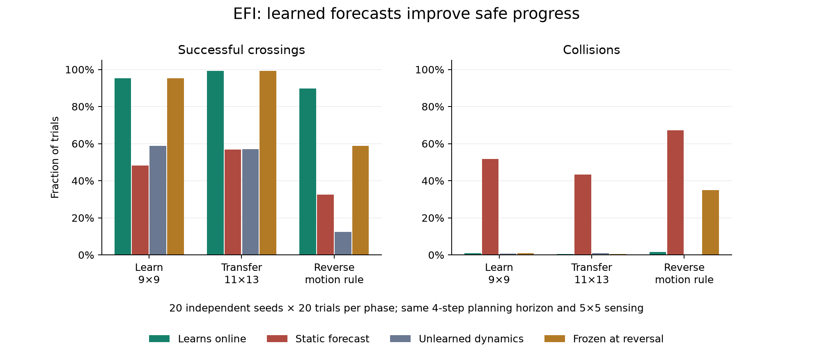

# Predictive crossing: learned motion changes control

EFI now has an opt-in egocentric controller that forecasts moving hazards
and chooses among four movements and waiting. It learns from a local 5×5
window, carries uncertainty forward, and uses predicted arrival costs in
a bounded temporal value calculation. Existing ForageWorld controllers and
their defaults are unchanged.

## Reproduce

```bash
python cli.py crossing --seeds 20 --episodes 20 --seed 1000 --horizon 4 \
  --out runs/predictive-crossing
```

This writes every trial to `results.json`, plus `episode.json` and an offline
`episode.html` replay. The replay shows the first successful transfer trial
that includes waiting; it is an illustration, not the evaluation sample.
Forecast panels show the agent's discovered map, including uncertainty in
unobserved cells. They display the recorded five-action policy rather than
reconstructing it from the spatial value alone.

For a quick functional run, use `--seeds 2 --episodes 4`. The statistical
results below use the full command, starting each of 20 seeds with an
untrained motion model. Learning continues during evaluation. Transfer and
reversal therefore include experience acquired earlier in the same run.

## What changed

`AnticipatoryFieldController` extends the existing egocentric controller.
The first four observation channels keep their existing meaning; a fifth
channel senses a noncollectible moving hazard. The interface accepts no
environment object, world dimensions, coordinates, motion direction, rule,
or phase label.

`MotionSchema` associates unique visible source/destination pairs within
one cell. Consecutive associations reveal incoming and outgoing movement.
It learns a categorical transition distribution indexed by incoming
movement and the four adjacent wall bits. Its 400 counts start at zero;
a symmetric 0.02 pseudocount supplies the prior. On each observed context,
old counts are multiplied by 0.9 before the new transition is counted.
This permits continuous adaptation without a change detector or controller
mode switch. The evaluation's frozen control disables these updates only.

Five directional occupancy channels carry motion uncertainty. A forecast
step redistributes their mass using the learned transition probabilities
and the known wall mask. Positive and negative local observations correct
that memory. Unknown incoming velocity starts uniformly distributed.
Transition log loss is scored **before** the corresponding update and is
reported for observed, associable transitions; it is not an all-cell
accuracy score dominated by empty background.

`arrival_values` propagates value backward through the forecast layers.
Each move pays its predicted destination hazard cost; reverse edge flux
also charges for exchanging cells with a hazard. Waiting is a fifth
action with the same step cost. A softmax over these action values chooses
movement or waiting. There is no crossing-specific decision tree. The
existing spatial value supplies the terminal heuristic; its boundary cost
is removed once to avoid charging the final arrival twice.

This is a finite-horizon entropy-regularized extension of the spatial
planner. It does not establish a new exact infinite-horizon LMDP solution
or a hard safety guarantee.

## Locality and compute

| Operation | Explicit spatial budget |
|---|---|
| Associate visible motion | Two composed radius-1 passes |
| Predict between observations | One radius-1 pass |
| Forecast h future steps | h radius-1 passes |
| Propagate temporal values backward | h radius-1 passes |
| Spatial terminal value | Existing κ sweeps; existing initial orientation budget |

The experiment uses h=4, κ=3, and a 31×31 internal map for every contender.
All contenders execute the forecast budget and temporal planner. All have
the same observation window, five actions, temperatures, subjective costs,
and 60-step trial limit. The static control replaces only the future hazard
layers with current occupancy; the unlearned control retains the uniform
transition prior. The frozen control forecasts normally, but stops updating
motion counts at reversal.

As with the existing predictive schema, learned rule parameters are shared
across positions. Forecast **state propagation** is local; learning is not
a claim of strictly neighbor-to-neighbor parameter transport. The locality
tests hold the learned rule fixed when measuring the forecast light cone.

## Experiment

Each seed has three consecutive phases of 20 trials:

1. **Acquire:** 9×9 crossing with a hazard that continues moving and reflects
   at the ends of its lane.
2. **Transfer:** 11×13 crossing with the same motion law. Spatial memory
   resets per trial; learned rules persist.
3. **Reverse:** the larger crossing remains, but the hazard reverses
   direction every tick. The agent receives no announcement of this change.

The motion law changes **between phases**, not midway through a trial in
this reported experiment. The environment also supports a `switch_step`
for future experiments. Rotations cover all four cardinal orientations
across seeds; transfer changes dimensions, not orientation within a seed.
Initial hazard phase and direction vary with the trial seed. Hazard paths
are independent of the agent's actions, so paired worlds have the same
external dynamics even when their agent trajectories diverge.

Collision or reaching the goal ends a trial. Collisions cost −2, successful
arrival gives +1, and every step costs −0.01. The hazard cost and radius-1
motion bound are supplied task priors. The transition rule is learned.
All acquisition trials, collisions, and timeouts count in the results.

## Results

Twenty seeds (1000–1019), 20 trials per phase and contender, 400 trials per
table cell: **4,800 total trials**. Full per-trial data and protocol are archived in
[results.json](assets/data/predictive_crossing/results.json).

| Phase | Learned forecast success | Static forecast success | Unlearned forecast success | Frozen at reversal |
|---|---:|---:|---:|---:|
| Acquire | 95.25% | 48.25% | 58.75% | 95.25% |
| Transfer | 99.25% | 56.75% | 57.00% | 99.25% |
| Reverse | 89.75% | 32.50% | 12.50% | 58.75% |



Recreate the figure with:

```bash
python scripts/plot_crossing.py runs/predictive-crossing/results.json \
  --out docs/assets/images/predictive_crossing.png
```

| Phase | Learned return | Static return | Unlearned return | Learned collisions | Learned timeouts |
|---|---:|---:|---:|---:|---:|
| Acquire | +0.780 | −0.631 | +0.230 | 1.00% | 3.75% |
| Transfer | +0.804 | −0.436 | +0.113 | 0.50% | 0.25% |
| Reverse | +0.582 | −1.184 | −0.440 | 1.50% | 8.75% |

The static forecast frequently collides. The unlearned forecast is usually
cautious but times out: 40.5%, 42.0%, and 87.5% across the three phases.
Learning improves the safety/progress tradeoff rather than merely buying
fewer collisions by refusing to move.

The frozen control is identical to the learned controller through acquisition
and transfer. At reversal, stopping motion-rule updates drops success to
58.75% and raises collisions to 35.0%, versus 89.75% and 1.5% with continued
learning. The paired success gain is +31 percentage points, with a seed
bootstrap interval of [26, 36]; all 20 seeds improve. This isolates the
contribution of updating the learned dynamics after a rule change.

Learned success exceeds both these controls in all 20 paired seeds in
every phase. Resampling seeds, keeping each seed's trials together, gives
the following 95% percentile bootstrap intervals for the success gain
(10,000 resamples, bootstrap seed 17):

| Phase | Gain over static, percentage points | Gain over unlearned, percentage points |
|---|---:|---:|
| Acquire | +47.00 [41.75, 52.50] | +36.50 [30.50, 42.50] |
| Transfer | +42.50 [37.50, 47.25] | +42.25 [38.00, 46.25] |
| Reverse | +57.25 [51.00, 63.25] | +77.25 [71.50, 82.25] |

## Regression protection

Before changing code, the original suite passed 213 tests with four
existing expected failures. A paired replay captured the published
200-episode ForageWorld protocol and 12 egocentric episodes, then repeated
them on this branch: **every serialized episode metric matched exactly**.
The standard protocol returned −0.068 with 98% success in both runs.
The older archived README result is −0.087 / 96.5%; this branch does not
claim to reproduce that historical number. Its regression reference is
the unmodified checkout in the same dependency environment.

Validation used Python 3.14.4 and NumPy 2.5.2; new Python sources were also
parsed with the Python 3.10 grammar. The isolated dependency environment
and detailed regression hashes are recorded in
[validation.json](assets/data/predictive_crossing/validation.json).

New tests exercise motion learning, prediction scoring before updates,
adaptation, hidden-observation exclusion, ambiguous associations, mass
propagation and wall blocking, both propagation budgets, future-cost
influence on waiting, edge collisions, intentional-wait odometry, and
behavior on separate test seeds (2000–2003).

The completed suite passes **224 tests with the same four expected
failures**. The existing demo and Gymnasium registration smoke checks pass.
The replay was exercised in Chromium (stepping, scrubbing, play/pause),
with no JavaScript errors after the final viewer fix.

## Limits

This demonstrates online anticipation and adaptation for an isolated
moving hazard in a narrow task family. It does not demonstrate contextual
cue memory, general manipulation, or superiority to learned robotics
policies. The matched controls isolate the contribution of learned
forecasts; they are not a broad competitive benchmark.

Motion is bounded to one cell per tick and walls are static. Association
assumes isolated objects; a unique visible match cannot resolve identity
ambiguity through crowds or occlusion. Unobserved hypotheses can remain
after an object is reacquired elsewhere, making occupancy conservative.
With multiple objects, clipped summed mass is an occupancy approximation.
The hazard does not react to the agent. Forecasts beyond four steps do not
affect the temporal calculation, and this experiment does not establish
that four steps outperform one. Pose correction and affect are disabled
for all contenders; noisy-odometry predictive control remains unmeasured.

The reversal phase still has 8.75% timeouts. That is a concrete remaining
weakness: planning with uncertain motion can delay useful action, and
escaping the observation window can slow further learning.
