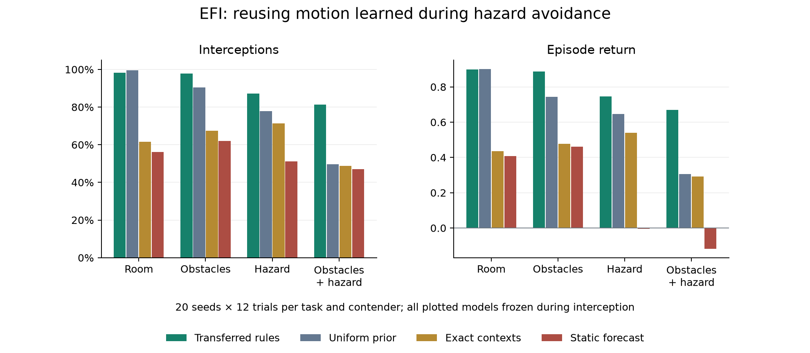

# Cross-task reuse of learned motion

The predictive controller can now reuse motion learned while **avoiding a
hazard** to **intercept a moving reward**, including in rooms with obstacles
and another moving hazard. This is an opt-in extension. The earlier crossing
controller and existing ForageWorld defaults retain their behavior.

## Reproduce

```bash
python cli.py transfer --seeds 20 --episodes 12 --acquisition 20 --seed 5000 \
  --horizon 4 --out runs/predictive-transfer
```

The command writes `results.json`, `episode.json`, and `episode.html`.
The JSON contains every acquisition and evaluation trial, the acquired
motion tables, aggregates, and paired seed bootstrap intervals. The offline
replay shows the **first** obstacle-and-hazard trial of the frozen transfer
controller, selected before its outcome was known. It displays the actual
five-action policy and both kinds of forecast on the discovered map.

For a functional smoke run use `--seeds 2 --episodes 2 --acquisition 4`.

## Capability and implementation

`RelationalMotionSchema` extends the original categorical motion model.
It keeps the same 400 raw counts, but expresses outgoing movements and
adjacent wall patterns relative to the object's incoming heading. Evidence
is pooled over rotated versions of the same context. For a wall context
without observations, a distribution of relative turns learned across other
contexts supplies one observation's worth of prior evidence. Specific
context evidence takes precedence as it accumulates.

This supplies rotation and geometry invariance as architectural biases.
Continuation, reversal, and turning probabilities are learned. All five
outgoing choices start equally weighted **before** conditioning on geometry;
there is no built-in momentum or reflection rule. A stationary object has
no heading, so its context evidence is averaged over four possible frames.

Forecasts also distinguish unseen cells from observed free cells. At each
location the model averages the motion kernels for the local wall patterns
compatible with sensing. Unknown wall bits have a symmetric prior. These
are 16 local hypotheses, not complete maps. This avoids projecting a nearly
certain straight trajectory through an unseen boundary.

An additional correction field limits stale tracking hypotheses. New local
sightings seed timestamps; those timestamps spread through four radius-1
max stencils per tick. Older occupancy hypotheses are suppressed where this
wave overtakes their trace timestamps. Distant hypotheses persist until the
correction reaches them. The mechanism assumes **one isolated object per
observation channel**, and rejects simultaneous multiple sightings in a
channel. It does not solve general object identity or multi-object tracking.

The controller's optional sixth observation channel senses a moving reward.
Hazard and reward occupancy occupy separate fields, while their motion
tables are shared. Recognition, reward sign, and contact value are supplied;
the controller does not infer that a previously harmful object became food.
The experiment tests reuse of dynamics across these supplied roles.

The temporal value update now includes the probability of collecting a
terminating reward at each future arrival. Collection replaces continuation
value, so waiting on a predicted target cannot collect it repeatedly. An
eight-sweep spatial approach field supplies a terminal estimate for targets
outside the immediate interception horizon. It starts cold each tick, uses
the final predicted target field, and discounts this approach estimate to
half the contact reward. Actual predicted collection retains the full reward.
This terminal approximation assumes the final forecast remains a useful
waypoint beyond the horizon; it is not an exact infinite-horizon solution.

All these decisions follow the same field equations in every target task.
The controller receives no task name, world shape, track coordinates,
direction, phase, or environment object. Its inputs are the local 5×5 window
and movement/pickup feedback. There is no interception decision tree.

## Experiment and controls

Each of 20 evaluation seeds (5000–5019) first learns through 20 crossing
episodes. The source hazard moves vertically in the unrotated world.
Afterward, only the 400 motion counts are copied into fresh controllers.
Spatial memory, target experience, and random-number state do not transfer.
Each target task begins from the same source table, and spatial memory
resets for every trial. The target moves horizontally in the unrotated world,
so its motion axis differs from the source hazard's within every seed.

Each task has 12 trials per seed and contender:

| Task | World | Objective |
|---|---|---|
| Room | 9×13 open room | Intercept a moving reward |
| Obstacles | 11×15, interior barriers | Route around barriers and intercept |
| Hazard | 11×15 open room | Intercept while avoiding another moving object |
| Obstacles + hazard | 11×15, interior barriers | Combine interception, routing, and avoidance |

All four orientations occur across seeds. Initial phase, direction, and
policy sampling vary by seed. Tracks are external dynamics and never given
to the agent. Rooms and barriers use fixed templates; this is not a test on
arbitrary procedural mazes. Reward and hazard each move one cell per tick
and reflect at walls, independently of the agent and each other.

Sharing an arrival cell with the reward collects it; exchanging cells does
not. Sharing an arrival cell or exchanging cells with the hazard causes a
collision, which takes precedence over collection. Every target trial has
24 steps, a −0.01 step cost, +1 collection reward, and −2 collision cost.
All collisions and timeouts remain in the results.

| Contender | Transferred evidence | During target trials |
|---|---|---|
| `transfer` | Acquired counts, relational pooling | Frozen |
| `scratch` | Empty counts, uniform motion prior | Frozen |
| `static` | Acquired counts | Frozen; future object fields replaced by current occupancy |
| `exact` | Same acquired counts | Frozen; original exact-context lookup, no pooling |
| `uncorrected` | Same acquired counts and pooling | Frozen; omit suppression by the correction wave |
| `online` | Acquired counts and pooling | Continue learning from hazards and rewards |
| `scratch_online` | Empty counts and pooling | Learn from target-task experience |
| `one_step` | Acquired counts and pooling | Frozen; one-step horizon |

`exact` still receives the same geometry uncertainty, correction mechanism,
reward planner, and approach field as `transfer`. It isolates the use of
shared relative-motion evidence. The `uncorrected` control executes the
correction stencils but does not suppress mass. The `static` control executes
the forecasts before replacing them. All target contenders use temperature
0.005, horizon four (except the explicit one-step control), and the same
spatial iteration budgets. Equal iteration budgets do not imply equal CPU
time: finite table pooling and mixing add work.

The source controller uses temperature 0.02. Development used seeds
3000–3003 and explored horizons four/eight, temperatures 0.02/0.005, and
terminal approach estimates. Early pilots transferred motion predictions
but did not improve interception. Those failures motivated the approach
field and treatment of unseen geometry. Settings were fixed before running
the separate evaluation seeds. Behavioral unit tests use seeds 7000–7003.

## Results

There are **7,680 target trials** (20 seeds × 12 trials × four tasks × eight
contenders), plus **400 acquisition trials**. Acquisition succeeds in
99.75% of trials, with 0.25% collisions and a mean return of +0.880.

| Task | Frozen transfer | Empty frozen model | Exact-context reuse | Static forecast |
|---|---:|---:|---:|---:|
| Room | 98.33% | 99.58% | 61.67% | 56.25% |
| Obstacles | 97.92% | 90.42% | 67.50% | 62.08% |
| Hazard | 87.08% | 77.92% | 71.25% | 51.25% |
| Obstacles + hazard | **81.25%** | **49.58%** | **48.75%** | **47.08%** |



```bash
python scripts/plot_transfer.py runs/predictive-transfer/results.json \
  --out docs/assets/images/predictive_transfer.png
```

On the combined task, the frozen transfer gain over the empty frozen model
is **31.67 percentage points**, with a paired seed bootstrap interval of
**[26.25, 36.67]**. Reusing the same counts through relative-motion pooling
instead of exact-context lookup gains **32.50 points [27.08, 37.50]**.
Mean return is +0.669 for transfer, +0.306 for the empty model, +0.292 for
exact-context reuse, and −0.117 for the static forecast.

All frozen transfer controllers have zero observed collisions in these
960 target trials; this is an observation, not a safety guarantee. On the
combined task they time out in 18.75% of trials. Static forecasts collide
in 18.33% of hazard-room trials and 21.67% of combined-task trials. The
empty and exact-context models also have zero collisions, but frequently
fail to collect within the deadline. Transfer improves progress as well
as maintaining the observed safety level.

| Task | Frozen transfer | Continue learning | Learn from scratch | One-step transfer |
|---|---:|---:|---:|---:|
| Room | 98.33% | 100.00% | 100.00% | 71.67% |
| Obstacles | 97.92% | 97.92% | 96.67% | 39.58% |
| Hazard | 87.08% | 96.25% | 95.42% | 52.08% |
| Obstacles + hazard | 81.25% | 87.50% | 87.08% | 42.08% |

This supports **immediate reuse**, not an asymptotic advantage over learning
in the target task. With target experience, a fresh learner nearly catches
the transferred online model. In the easy room, the empty frozen model
already succeeds in 99.58% of trials and slightly exceeds transferred
success. Transfer is not uniformly beneficial across all tasks.
The transferred model paid for 20 source episodes per seed; the empty
controls discard that evidence. This comparison does not establish lower
total experience or compute cost than learning directly in the target task.

Four-step transfer exceeds the one-step control on all four tasks. On the
combined task the gain is 39.17 points [32.08, 46.25]. This establishes a
benefit of the larger planning budget in this experiment, without claiming
equal compute or an optimal horizon.

The correction wave's behavioral contribution is mixed. Omitting it gives
99.17%, 98.33%, 85.42%, and 78.33% success across the four tasks. Its combined
task gain is 2.92 points [−0.83, 7.08], while it slightly reduces returns in
the two tasks without hazards. The tests establish its bounded suppression
of stale hypotheses; this experiment does **not** establish a consistent
performance gain from that component alone.

The complete evidence is in [results.json](assets/data/predictive_transfer/results.json);
the smaller [summary.json](assets/data/predictive_transfer/summary.json) contains
the protocol, aggregates, and paired differences. Intervals resample the 20
seed means, keeping each seed's trials together, using 10,000 resamples.
These are descriptive 95% percentile intervals without multiple-comparison
correction. Acquisition experience is shared across a seed's evaluations;
individual target trials are not treated as independent trained agents.

The per-trial `prediction_log_loss` scores associable observed transitions
before learning. It is conditional on the recorded wall context, rather
than a calibration score for the full uncertain-geometry forecast. Different
controllers visit different states, so their aggregate prediction losses
are not comparisons on identical input sequences. `learned_transitions`
counts target-model updates; frozen-count assertions additionally check that
neither object stream changes the shared table in frozen contenders.

## Locality and preservation

| Operator | Spatial propagation budget |
|---|---|
| Wall/visibility context | One radius-1 stencil |
| Motion association | Existing two composed radius-1 passes |
| Occupancy transport | One radius-1 pass per forecast step |
| Trace timestamp support | One radius-1 pass per tick |
| Sensory correction wave | Four radius-1 passes per tick |
| Temporal value propagation | Four backward radius-1 passes, or one in the ablation |
| Target approach field | Eight cold radius-1 value sweeps |
| Existing spatial value | κ=3; initial 20 additional window-scale sweeps |

These operators compose: a four-step forecast is not a claim that the whole
controller has a four-cell information cone. Learned parameters are shared
across positions and object roles, as in the previous predictive schema.
Finite table pooling is not purely neighbor-to-neighbor plasticity. The
spatial locality tests hold the learned rules fixed. No global spatial
normalization, distance transform, flood fill, or true world map is added
inside the controller.

The 212 original foraging/egocentric episodes and all 4,800 trials from the
previous crossing milestone reproduce **byte-for-byte identical recorded
results**. The original controller defaults keep the exact-context motion
model and five-channel observation contract. Moving rewards and relational
tracking require explicit configuration.

The complete suite passes **240 tests with the same four expected failures**,
including all 224 tests from the prior milestone and 16 new tests. New
checks cover reuse across heading and geometry, unbiased motion priors,
context-specific evidence, rotation equivariance, both correction and
forecast locality, preservation through occlusion, uncertain geometry,
terminating reward accounting, frozen/shared evidence, collision semantics,
and behavior on separate test seeds. Detailed hashes and the validation
environment are saved in [validation.json](assets/data/predictive_transfer/validation.json).
The CLI, Python 3.10 grammar, new-code lint, and offline Chromium replay were
also checked. Playback, stepping, scrubbing, both forecast types, and a
390-pixel viewport worked without page errors.

## Limits

This demonstrates reuse of simple object dynamics across changed geometry,
heading, reward role, and a combined navigation task. It does not establish
general reasoning, arbitrary task transfer, manipulation, contextual rule
memory, or superiority to neural policies. Supplied priors include object
recognition, semantic channels, a one-cell speed bound, rotation invariance,
single-object tracking per channel, and the reward/collision semantics.

Forecasts use occupancy marginals, so repeated hypothetical missed captures,
geometry hypotheses over time, and hazard/reward dependence are approximated.
Hazard costs retain the earlier additive penalty approximation; predicted
reward and hazard contributions can overlap, while the environment gives
collision priority. Zero observed collisions does not make that cost model
an exact model of terminal collision outcomes.
The timestamp support envelope is conservative and does not track identities
or a separate timestamp for every probabilistic path. Reacquisition outside
the correction cone can still temporarily duplicate hypotheses. The approach
estimate is a heuristic. Frozen counts do not mean frozen sensory beliefs:
position and heading inference continue during every transfer trial.

The source and target share the same physical law. This experiment does not
test transfer to different physics, noisy odometry, sensor occlusion by
walls, or crowded scenes. The 5×5 observation is a square window as in the
earlier crossing environment, not ray-cast vision.
